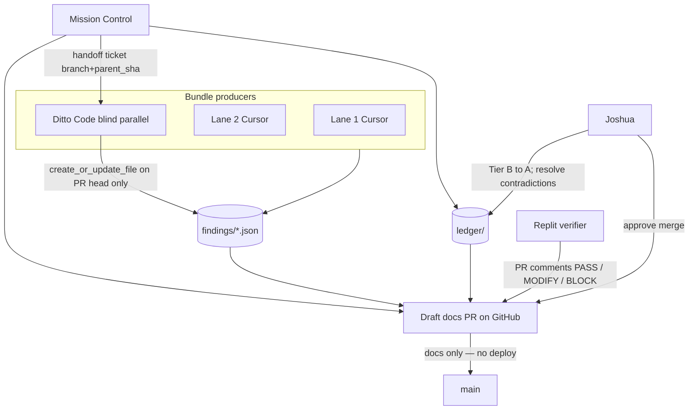

# Cross-agent review workflow (Replit, Gemini, Ditto)

How external programs collaborate on the audit **without** mixing product code
into evidence PRs. Mirrors the F04 / #1317 loop: Cursor opens a docs PR → Replit
spot-checks in PR comments → Joshua gates Tier A → merge.

## Roles (do not collapse)

| Seat | Primary surface | Does | Does not |
|---|---|---|---|
| **Lane 1 / Lane 2** (Cursor) | `findings/*.json` | Produce bundles at pin | Edit `ledger/claims.json` |
| **Mission Control** (Cursor) | `ledger/*.json` + draft PR | Strip-validate bundles; index claims; open/merge docs PRs | Fetch code for audit; product fixes |
| **Replit** | **GitHub PR comments** | Independent spot-check: PASS / MODIFY / BLOCK per bundle or file | Author bundles; merge |
| **Ditto Code** | **`findings/*.json` on evidence PR branch** | Blind parallel fetch (GitHub route); `create_or_update_file` with MC ticket | Any `ledger/*`; merge; self-verify; commit off-PR |
| **Ditto memory** | `save_memory` | STATUS mirror | Authoritative ledger |
| **Joshua** | PR approval + `claims.json` | Tier **B → A**; resolve contradictions | — |

**Gemini is off the critical path.** Ditto Code picks up blind parallel production
(GitHub fetch route). Replit spot-checks on PR. See
[`DITTO-HANDOFF.md`](DITTO-HANDOFF.md) — Ditto commits only after MC posts branch +
parent SHA + claim_id slice.

## Flow



Solid arrows = normal git path. Ditto never commits without MC handoff ticket
([`DITTO-HANDOFF.md`](DITTO-HANDOFF.md)).

## Evidence PR lifecycle

1. **Produce** — Lane workers (or Gemini via separate deliverable) write
   [`findings/{claim_id}.json`](findings/) per
   [`evidence-bundle-schema.md`](evidence-bundle-schema.md).
2. **Index** — MC adds/updates rows in [`ledger/claims.json`](ledger/claims.json)
   (`review_status: pending`, `tier: B`).
3. **Open PR** — Branch e.g. `audit/evidence-2026-10-05-smoke`; **draft**; docs
   only under `cursor-agents-communication/audit-kit/`.
4. **Replit review** — Comment on the PR with pinned commands and raw output:
   - **PASS** — bundle matches pin bytes / logs cited
   - **MODIFY** — schema OK but `refutes_if` or evidence weak
   - **BLOCK** — pin mismatch or unreproducible receipt
5. **Ditto blind parallel** — MC posts handoff ticket (PR #, branch, `parent_sha`,
   claim_ids). Ditto commits `findings/*.json` to **PR head only** with
   git-replayable `fetch_method`. Replit reruns after publish.
6. **Contradictions** — Ditto flags via `conflicts_with` or PR comment; **MC**
   writes `ledger/contradictions.json`. Both bundles stay Tier **B**; no
   seniority promotion.
7. **Joshua gate** — Set `tier: "A"` and `verified_by` includes `joshua` only after
   spot-check; set `review_status: merged` when PR merges.
8. **Merge** — No Fly deploy; same class as [#1322](https://github.com/cryptoreporthub/subnet-dashboard/pull/1322).

## What stays out of git

- Agent chat transcripts (except verbatim receipts inside bundle JSON)
- Ditto memories as authoritative ledger (mirror decisions, not replace `claims.json`)
- Lane 2 raw log dumps > ~50 KB (attach excerpt in bundle + store full log elsewhere;
  link path in `evidence[]`)

## Comment template (Replit / any PR reviewer)

```markdown
## Spot-check: {claim_id}

**Verdict:** PASS | MODIFY | BLOCK

**Pin:** ce3d820013d45577333ac8aada8c0d9e97c54129

**Command run:**
\`\`\`bash
git show ce3d8200:server.py | nl -ba | sed -n '510,512p'
\`\`\`

**Raw output:**
\`\`\`
(paste)
\`\`\`

**Notes:** (optional MODIFY/BLOCK rationale)
```
