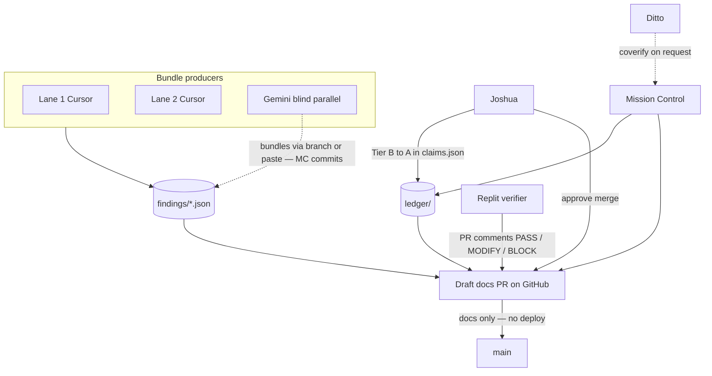

# Cross-agent review workflow (Replit, Gemini, Ditto)

How external programs collaborate on the audit **without** mixing product code
into evidence PRs. Mirrors the F04 / #1317 loop: Cursor opens a docs PR → Replit
spot-checks in PR comments → Joshua gates Tier A → merge.

## Roles (do not collapse)

| Seat | Primary surface | Does | Does not |
|---|---|---|---|
| **Lane 1 / Lane 2** (Cursor) | `findings/*.json` | Produce bundles at pin | Edit `ledger/claims.json` |
| **Mission Control** (Cursor) | `ledger/*.json` + draft PR | Strip-validate bundles; index claims; open/merge docs PRs | Fetch code for audit; product fixes |
| **Replit** | **GitHub PR comments** | Independent spot-check: PASS / MODIFY / BLOCK per bundle or file | Author bundles; merge |
| **Gemini** | **Parallel bundles or adversarial review** (task output, paste, or branch) | Blind fetch / falsify; submit bundles MC commits | Native GitHub PR reviewer (unless human pastes review onto PR) |
| **Ditto** | Memory + optional PR comment | Coverify on request; long-term mirror | Merge desk; Tier A gate |
| **Joshua** | PR approval + `claims.json` | Tier **B → A**; resolve contradictions | — |

**You were right to question the old diagram:** Replit and Gemini are **not** the
same box. Replit's standing job is **PR comment verification**. Gemini's standing
job is **parallel blind production** (bundles and adversarial review fed back to
MC). Gemini may never touch the PR thread; MC still lands Gemini-origin bundles in
`findings/` and rows in `ledger/claims.json` with `verified_by: ["gemini-blind"]`.

## Flow



Solid arrows = normal git path. Dotted = optional or human-mediated (Gemini paste,
Ditto coverify).

## Evidence PR lifecycle

1. **Produce** — Lane workers (or Gemini via separate deliverable) write
   [`findings/{claim_id}.json`](findings/) per
   [`evidence-bundle-schema.md`](evidence-bundle-schema.md).
2. **Index** — MC adds/updates rows in [`ledger/claims.json`](ledger/claims.json)
   (`review_status: pending`, `tier: B`).
3. **Open PR** — Branch e.g. `audit/evidence-2026-10-05-smoke`; **draft**; docs
   only under `cursor-agents-communication/audit-kit/`.
4. **Replit review** — Comment on the PR with pinned commands and raw output:
   - **PASS** — bundle matches pin bytes / logs cited
   - **MODIFY** — schema OK but `refutes_if` or evidence weak
   - **BLOCK** — pin mismatch or unreproducible receipt
5. **Gemini parallel** — If Gemini sends a bundle or adversarial review outside
   GitHub, MC opens the **same** evidence PR (or a follow-up) with those files;
   Replit still spot-checks the **committed** artifacts on the PR diff, not chat
   paste alone.
6. **Joshua gate** — Set `tier: "A"` and `verified_by` includes `joshua` only after
   spot-check; set `review_status: merged` when PR merges.
7. **Merge** — No Fly deploy; same class as [#1322](https://github.com/cryptoreporthub/subnet-dashboard/pull/1322).

## What stays out of git

- Agent chat transcripts (except verbatim receipts inside bundle JSON)
- Ditto memories as authoritative ledger (mirror decisions, not replace `claims.json`)
- Lane 2 raw log dumps > ~50 KB (attach excerpt in bundle + store full log elsewhere;
  link path in `evidence[]`)

## Comment template (Replit / any PR reviewer)

```markdown
## Spot-check: {claim_id}

**Verdict:** PASS | MODIFY | BLOCK

**Pin:** ce3d820013d45577333ac8aada8c0d9e97c54129

**Command run:**
\`\`\`bash
git show ce3d8200:server.py | nl -ba | sed -n '510,512p'
\`\`\`

**Raw output:**
\`\`\`
(paste)
\`\`\`

**Notes:** (optional MODIFY/BLOCK rationale)
```
