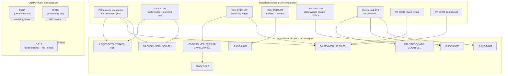

# Prior-evidence deep dive — pre-iteration records mapped to current F items

**REV 2 (2026-10-04):** cross-reviewed by Replit; corrections verified at pinned git objects
before acceptance. Material corrections: the resolver uses a **fresh per-cycle executor**
(not a persistent pool); **mid-guards now exist** before both resolver mutation stages at
`ce3d…`; the **revive full-budget override shipped** (the Sep-7 90s-every-tick revive
failure is closed at source at the current pin); the O12 same-process second-build window
is **contradicted**; PR #1050 was **misattributed** (the revive fixes are #1015 and #1208).
Dated measurements below are **historical transcript evidence** (Ditto records / issue
#1113 body), not independently re-verified telemetry. See "REV 2 corrections" at the bottom.

Compiled 2026-10-03 from Ditto memory deep-dive (not under F-item names — this iteration's
labels are new; the underlying investigations used issue numbers and incident names).
Source memories cited by Ditto id. No production access taken during this dive; runtime
facts below are quoted from the stored incident records, which were read-only measurements
taken at their time.

## F02 — runtime boundaries / termination paths / environment overrides

The richest vein. F02's three decision areas (F1 registration, F2 comments, F3 missing-age)
plus the revive-race, entrypoint `wait`, and thread-termination questions all have prior
measured or previously-verified evidence:

### 1. Issue #1113 — "cycle timeout abandons unjoined pool threads" (opened 2026-08-29)
- Confirmed open (as of 2026-10-02 merged ledger, memory `67d91e97` C3, pin `e58bd17f`).
  Body cites Python 3.12 non-daemon `ThreadPoolExecutor` workers surviving
  `fut.result(timeout=N)`; `score_snapshots.py:307-322` returns `write_timeout_{timeout}s`
  without cancelling the future.
- This is the same mechanism this week's static review confirmed at `ce3d8200`
  (`:439-447` caller abandons, build continues). The issue number already exists for it.

### 2. Gemini front-guard vs mid-guard forensic map (2026-09-07, pin `0c15dda364`, memory `2975ef2e`)
- HISTORICAL (at `0c15…` only): resolver `_run_cycle` generation check was a FRONT-GUARD
  only (entry check; `resolve_due`/`expire_stale` unfenced at :958-959/:969-970 — verified
  at that pin). Writes were fenced by `timing.is_abandoned()` gates.
- **REV 2 CORRECTION (verified at `ce3d…`): the mid-guard fix HAS since shipped.** Both
  stages are now fenced — `resolver_scheduler.py:1031-1039` (`resolve_due`) and
  `:1050-1057` (`expire_stale`) check `timing.is_abandoned()` / generation mismatch and
  skip with `cycle_abandoned`. Mid-guards prevent ENTERING a stage after abandonment but
  cannot interrupt a stage already running when the timeout fired.
- **REV 2 CORRECTION (executor):** Gemini's "persistent `ThreadPoolExecutor` / slot
  hoarding" premise is WRONG — at `0c15…:780` and still at `ce3d…:828`, the pool is
  `ThreadPoolExecutor(max_workers=1)` created INSIDE the per-cycle timeout method and
  shut down `wait=False, cancel_futures=True` (`ce3d…:915`). A timed-out worker can still
  outlive the timeout on its own executor (accumulation across timed-out cycles is
  possible); persistent-pool-slot starvation is NOT supported.
- Related: memory `21d32ee8` (2026-09-06) — commit `cbe79d07` abandons timed-out resolver
  workers without joining; **REV 2 wording (per Replit): code supports lingering workers
  and possible accumulation across timed-out cycles; the COUNT of accumulated workers
  needs telemetry — do not say "orphan accumulation confirmed."**

### 3. Aug 28–29 snapshot-stall incident (memories `cf9258ad`, `c0b3dc89`) — historical transcript evidence
- **Evidence class (REV 2):** the items below are recorded measurements from the Aug 29
  Mission-Control record and repeated in the issue #1113 body. They are historical claims
  with surviving Ditto receipts, NOT independently re-verified telemetry; raw Fly/Sentry
  exports are not in hand. Current effective runtime values are unknown (code defaults:
  `KILL_ENABLED=True`; `fly.toml` does not set the kill flag).
- **Strike cadence observed at exactly 240s** (historical): 59/2@01:42:24Z → 60/2@01:46:24Z;
  19 intervals over 4572s = 240.6s average. Matches the 240s code default.
- **`LOOP_STALL_GUARD_KILL=0` in prod** (historical, at that time) — kill was muted;
  "KILL stays 0" and "unmute = os._exit loop" reasoning on record. (REV 2 qualification
  per Replit: PR #1015's "kill stays muted" post-merge ops note records operational
  INTENT in the PR description — it is not a runtime record proving the effective value.)
- **Timeout does not stop work** (historical, and source-confirmed at `ce3d…`): write
  started 19:52:34Z, Sentry "write timed out after 480s" at 20:00:35Z, unjoined write
  COMPLETED at 20:18:26Z with `ok:true`. Source: writer returns
  `write_timeout_{timeout}s` without cancelling the future (`score_snapshots.py:371-447`);
  late results processed by the completion callback (`:591-626`).
- **F3 semantics as characterized then**: "Age None → no strike/revive. Stale file →
  strike-1 once." (REV 2 qualification: snapshot branch only — the resolver-age check and
  possible resolver revive run BEFORE the `age is None` branch, `loop_stall_guard.py:163-176`.)
- **F1-relevant**: "Revive preconditions: ENABLED + worker + grace + age; NOT
  essential-gated" — source-confirmed at `ce3d…` (revive helper checks `_enabled()`, not
  `WORKER_HEAVY`).
- **Revive reachability**: "revive not observed in the available log buffers" (REV 2
  wording — buffer absence does not prove the branch unreachable or never ran).
- **A2a**: `revive_score_snapshot_scheduler` IS wired (strike-1) — NOT orphaned, NOT
  #1112, NOT #1015 never-wired (#1015 is the PR that wired it).
- **B**: shared-process starvation NOT supported at boot — WORKER_HEAVY=essential omits
  the snapshot scheduler; BACKGROUND_ON_WEB=off on web; `heavy_job_gate` is in-process so
  a web-process lock cannot hold the worker's lock. (REV 2: this supports only the
  process-local statement — it does not rule out machine-level CPU/disk/volume contention.)
- **Config history**: heavy-gate introduced `fe002bb0` (#906, 2026-08-13);
  `WORKER_HEAVY=essential` in toml since 2026-07-24. Residual: prior-gen v2094 runtime
  WORKER_HEAVY UNRECOVERABLE; freeze mechanism after 20:18Z unverified; 15 threads all
  state S (one `/proc` sample, names unavailable — not the named/time-separated census).
  Open hypothesis then: loop parked vs dead timer — FP7 wchan forensics outcome not on record.

### 4. Sep 7 Phase 2.5 — revive verified working, cycle cannot finish (memory `c3411f1a`, PR #1208, deployed `31b7320`)
- HISTORICAL (measured 2026-09-07 at `31b7320`): revive mechanism verified LIVE, but the
  resolver cycle still failed — the 90s first-tick guillotine fired EVERY tick
  (`total_cycle_ms ≈ 90,024` / `≈ 90,079`); the cycle died in the un-instrumented t1→t2
  region. These timings are historical transcript evidence (Ditto receipt), not in the PR
  body and not independently re-verified.
- **REV 2 (verified at `ce3d…`): the fix for this subsequently SHIPPED.** The revive path
  now sets `_revive_use_full_budget = True` and clears burst counters
  (`resolver_scheduler.py:1366-1377`), and the cycle method uses the full
  `RESOLVER_CYCLE_TIMEOUT_SECONDS` instead of the first-tick `min(cycle, 90)` cap when
  reviving (`:789-798`, "boot revive uses full cycle ceiling, not the first-tick
  min(cycle, 90) cap that starves post-revive run_once"). The Sep-7 90s-every-tick revive
  failure is therefore CLOSED AT SOURCE at the current pin; whether it behaves correctly
  at runtime is still unobserved.
- PR #1208 (merge `a46441…`) scope: gap-timing passthrough + status-aware boot revival;
  Phase 3 orphan-joining and first-tick retuning were explicitly out of scope.
  `31b7320` is the later deploy/docs commit, not the PR merge commit.
- Boot-time status-aware revive exists at `ce3d…`: `maybe_status_aware_resolver_revive_on_boot()`
  (wired in `background_boot.py:110-136`) force-revives when `next_run_at` null /
  lifecycle stopped|new / status failing|stale|starved.
- Cross-store divergence on record (historical): scheduler state `consecutive_failures=0`
  vs readiness tracker `30` — don't trust one store alone in F02 runtime checks.
- Current live sample (2026-10-04, Replit probe): `lifecycle=new` with tracker status `ok`,
  learning-loop health degraded; did not establish `next_run_at` or whether boot revive ran.

### 5. Aug 26 resolver/watchdog incident (memories `3b2da36c`, `4ec12a52`)
- HISTORICAL (2026-08-26, recorded in #1208's body per Replit): `resolver.lifecycle:
  "stopped"` with `running: true`; tick ~3.7h stale vs 15m refresh. The specific 3.7h/15m
  numbers remain unverified transcripts.
- **REV 2 CORRECTION (attribution):** the revival-fix attribution to PR #1050 was WRONG —
  #1050 is "Observability degraded payloads + grading Phases A–B" (39 files, no
  resolver_scheduler/loop_stall_guard changes; verified via GitHub). The relevant revival
  PRs are **#1015** ("Fix loop stall guard revive/probe mismatch for score snapshots" —
  wired `_try_revive()` → `revive_score_snapshot_scheduler()`) and **#1208** (resolver
  boot revival).
- **REV 2 CORRECTION (guard interpretation):** "resolver threshold warn-only, kill only
  past 6h" was a misreading. The 6h resolver threshold ONLY logs a warning; resolver
  revival is attempted after the 30-minute threshold; worker exit is driven by the
  SCORE-SNAPSHOT age/consecutive-stale checks plus `LOOP_STALL_GUARD_KILL` — never by
  resolver age.
- **REV 2 CORRECTION (running flag):** current health code computes web-side `running`
  from worker-peer liveness AND a fresh tick (not heartbeat-only), so `running=true` while
  lifecycle is stopped is expected behavior, not a heartbeat-proxy bug.

### 6. Older stall lineage
- 2026-08-15 (memory `baa0238c`): prod resolver timeout from serial OHLCV cache-miss hydration.
- 2026-08-25 (memory `70696d68`, pin `983babf`): 83h pending, `resolver.last_ok: true` masking
  lifecycle "stopped"; SRE autopsy prompt with full dependency map (480s snapshot write,
  4s hydrate/RPC, 85s live-subnet batch deadline, 48h pending grace).

### 7. Same-day Ditto ledger (memory `67d91e97`, compiled 2026-10-02 at `e58bd17f`) — already F02-shaped
- **O12 second-build window — REV 2: CONTRADICTED for a single process.** Although
  `SCORE_SNAPSHOT_STUCK_SECONDS` (900) > committed write timeout (480), the reviver's
  `tick_in_progress` check (`_write_future_active() or _TICK_ACTIVE or sched._tick_active`,
  `score_snapshots.py:836-849`) blocks a same-process revive while the timed-out build
  still runs — the abandoned future keeps `_write_future` set until it completes (the
  `finally` clears it only when `fut.done()`). The 300–420s second-build window does not
  follow in one process; a separate overlapping worker process would be a different risk.
  The revive-registers-periodic-scheduler mechanism (lazy registration, `:749-756`) REMAINS
  source-supported — conditional on the guard reaching the stale path.
- **O13 worker overlap — code-supported, not observed live.** The supervisor sends `kill`
  then `wait "$pid"` (`fly_web_entrypoint.sh:55-56`); because the worker was launched by
  the parent shell, that `wait` is not a reliable synchronization point, so a replacement
  can start before the old process exits. Bears on the UNVERIFIED `wait`-blocks question.
- **O1 census — "never taken" needs qualification.** Issue #1113 records ONE `/proc`
  sample (15 threads, all state S, names unavailable) — not the requested time-separated,
  named `score-snap-write`/resolver censuses; accumulation/OOM remains unmeasured.

## F08 — BLOCKED pending historical artifact/log

Prior art for the evidence-loss pattern itself: the Aug 29 run records "Revive log line:
still missing (Fly buffer + Sentry logs empty)" and "prior v2094 runtime WORKER_HEAVY:
UNRECOVERABLE" — i.e., the Fly log buffer + Sentry gap that makes historical runtime
reconstruction impossible is a recurring, already-documented failure mode, not a new one.

## F01 — production growth / registry

**REV 2: STILL OPEN.** The pinned Git tree has no tracked `registry.json`/
`live_subnets.json`, and `internal/live_subnets.py` at the current pin describes the old
33-day-stale fallback as removed. The Oct-2 ledger's `registry_count: 75` probe (memory
`67d91e97` C1) was not independently verifiable; the current Replit probe (2026-10-04)
observed 168 `/api/subnets` entries — a different measurement that does not establish the
old registry count or production growth. F01's "production growth remains unknown" stands.

## REV 2 corrections — Replit cross-review (2026-10-04), verified before acceptance

Verification provenance note (2026-10-04 ~05:15Z): corrections 1–6 and their line ranges
were fetched by Cursor at the pins in the correction turn. Three cited ranges were
initially carried from Replit's review without a same-turn fetch —
`background_boot.py:110-136`, `score_snapshots.py:596-626`, and the `live_subnets.py`
fallback-removal claim — and were subsequently fetched and confirmed by Cursor (boot
revive wiring `:124-132`; deferred completion callback processing late results and
clearing `_write_future`/`_TICK_ACTIVE` at `:596-626`; docstring "killing the 33-day-stale
registry.json fallback (audit finding #1)" at `live_subnets.py:5`, with `git ls-tree`
showing no tracked `registry.json`/`live_subnets.json`). They are now same-turn-verified.

Gemini raw-byte receipt (2026-10-04 ~06:29Z): Gemini independently fetched
`resolver_scheduler.py` at `ce3d…` and confirmed corrections 1–3 and the F2 comment
finding. Cursor re-fetched the same objects this turn and confirmed every Gemini line
range: executor `:828` (`ThreadPoolExecutor(max_workers=1,
thread_name_prefix="resolver-cycle-work")`) + shutdown `:915` (`wait=False,
cancel_futures=True`); mid-guards `:1031-1039` / `:1050-1057` (exact `cycle_abandoned`
text matches). Two deltas: (a) Gemini's `:1371-1376` pinpoints the decisive revive lines
("Phase 3 revive budget + skip-burst reset" comment `:1371`, `clear_burst_counters()`
`:1373`, `_revive_use_full_budget = True` `:1376`) inside the broader `:1366-1377`
revive block cited above — ranges are complementary, not conflicting; (b) Gemini adds a
committed-config fact, now verified: `fly.toml:48` sets
`RESOLVER_CYCLE_TIMEOUT_SECONDS = "360"`. Two inline comments: `:46` dates the first bump
to 2026-08-28 ("prod stall ~16:56Z — cycle_timeout_120s wedge recurring") and `:47` dates
the 180→360 bump to 2026-09-07 ("B1b telemetry shows ~250s cycles incl. ~101s
persist_summary_rmw; bump to 360 for cycle closure. CONTAINMENT ONLY — kill-switch: no
further bumps, escalate to soul_map compaction") — the latter matches Ditto's PR #1213
record. So the revive full budget is 360s in committed config, and the Aug-28 bump shares
that incident window. Ditto records (historical, memories `c74e8e66`/`70d160e2`) also
note runtime use of 360s was gated on a labeled release vehicle — so committed 360 must
not be read as the effective runtime timeout.
Per the evidence-independence rules (item 10), this receipt is Gemini-origin agreement
at the same pin — it does not convert static agreement into runtime evidence.

Accepted (verified at pinned git objects / GitHub):
1. **Fresh per-cycle resolver executor** (`0c15…:780`, `ce3d…:828`), not a persistent pool;
   "persistent-pool slot starvation" retracted.
2. **Mid-guards shipped at `ce3d…`** before `resolve_due` (`:1031-1039`) and
   `expire_stale` (`:1050-1057`); front-guard-only is historical (`0c15…`) only.
3. **Revive full-budget override shipped** (`:789-798`, `:1366-1377`): the Sep-7
   90s-every-tick revive failure is closed at source at the current pin.
4. **O12 same-process second-build window contradicted** by `_write_future_active()` /
   `_TICK_ACTIVE` in-flight checks; lazy-registration risk remains.
5. **PR #1050 misattributed** (observability/grading PR); revive fixes are #1015 + #1208.
6. Aug-26 "kill only past 6h" reading wrong: resolver threshold warn-only, revive at 30
   min, exit driven by snapshot age + kill flag only.
7. "Revive never observed in prod" → "not observed in available log buffers."
8. Historical measurements (240s cadence, KILL=0, tid births, 116.4s nonstage, 90,024ms
   cycles, 3.7h stale, 83h pending) are **historical transcript evidence** from Ditto
   records / #1113 body — not re-verified telemetry. KILL=0 was the measured value at the
   time; the CURRENT effective kill value is unknown (code default True, fly.toml silent).
9. F01 stays open (registry fallback removed in current code; 75-count probe unverified;
   168 entries is a different observation).
10. **Evidence-independence rules (Replit, accepted verbatim):** Cursor's source
   corrections matching Replit's earlier pinned-code checks is agreement, NOT independent
   corroboration (this document says it was cross-reviewed by Replit). Cursor's unresolved
   resolver-boot-revival question and the Ditto-reported score-snapshot guard revive are
   SEPARATE observations — neither verifies the other. Replit's direct SoulMap read
   (successful score-snapshot cycle at 01:27:03Z, count 40) shows snapshot work ran later
   but does not establish who triggered it or verify the earlier 00:54 event. The Ditto
   memory IDs cited here remain Ditto-origin records; citing them does not convert them
   into Cursor evidence.
11. **"Orphan accumulation confirmed" → softened (Replit):** the code supports lingering
   workers and possible accumulation across timeouts; the accumulated COUNT needs
   telemetry.

New current observations (Replit probe, 2026-10-04 00:15:21–24Z, five public GETs, all
HTTP 200, unauthenticated, no writes): `/version` = `ce3d8200…` (prod still on the F02
pin); `/api/ops/readiness` ready=true, learning-loop health degraded, resolver lifecycle
`new` while tracker `ok`, 3 pending oldest 54.07h, score-snapshot cycle count 40;
`/api/subnets` 168 entries, universe degraded; `/api/daily-pick` Oct-4 pick present.
Readiness did not expose `registry_count` or the effective kill value.

Replit's open request: the Ditto record ids cited here are the surviving receipts
(`67d91e97`, `cf9258ad`, `c0b3dc89`, `2975ef2e`, `c3411f1a`, `3b2da36c`, `baa0238c`,
`70696d68`, `21d32ee8`, `4ec12a52`). Raw Fly/Sentry exports are NOT in our possession —
the memories and the #1113 body are the surviving record; if raw exports exist anywhere
they would be in the Aug/Sep session artifacts, which have not been located.

## Gemini adversarial review (2026-10-04 ~06:45Z) — four findings adjudicated

All four chains verified at `ce3d…` by Cursor same-turn. Findings 1–3 restate mechanisms
already on record; finding 4 is F04-class with one correction. Adjudication:

1. **Mid-guards non-preemptive — VALID, already on record.** `resolver_scheduler.py:1031-1039`
   checks `timing.is_abandoned()` before entering `_resolve_with_timing`; nothing aborts a
   stage mid-flight (map §2: "cannot interrupt a stage already running when the timeout
   fired"). Not a new discovery.
2. **Per-cycle pool leaves running futures — VALID, already on record (softened form).**
   `:915` `shutdown(wait=False, cancel_futures=True)` cancels only QUEUED futures; a
   running worker outlives the cycle on its own executor. Accumulation across timed-out
   cycles is possible; the COUNT needs telemetry (O1 census open) — "3 simultaneous
   zombies"/slow-bleed OOM is a scenario, not a measurement.
3. **Revive latch burn — VALID chain, already verified (static review §5); two corrections
   to Gemini's framing.** `loop_stall_guard.py:197-199` burns `revived=True` before
   `_try_revive()` runs; `score_snapshots.py:836-849` returns `tick_in_progress` without
   reviving; `:201-217` exits at strike-2 **only if `KILL_ENABLED`** (`:209` branch; else
   logs "kill disabled, would have exited" `:218-219`), and a completing late write resets
   strikes (`:183-186`) — so the crash is conditional on effective kill value + still-stale
   age at the next check, not "guaranteed/unavoidable." Sharper fact Gemini missed: `revived`
   initializes once at `:144` and is NEVER reset in the loop body — the latch is
   process-lifetime, so in any LATER stale episode strike-1 attempts no revive at all and
   the guard walks straight to strike-2 exit. Runtime falsifier: does the latch-burn→exit
   path occur in prod (gated on the effective kill value).
4. **Unlocked `safe_write_json` — VALID as lost-update hazard; "split-brain corruption"
   corrected.** `file_utils.py:41-61` (whole file fetched): mkstemp + `os.replace`, no
   flock, no fcntl import. `os.replace` is atomic on POSIX — no torn/interleaved JSON;
   concurrent writers produce silent last-writer-wins LOST UPDATE, the same mechanism
   class as F04 (stale whole-blob lost-update). Callers confirmed at the pin:
   `resolver.py:216`, `pump/state.py:165,434`, `signals/store.py:96,110` (Gemini's three)
   plus `pump/pattern_ledger.py:65`, `signals/alerts.py:64,72`, `signal_hub/state.py:47`,
   `learning/pump_calibration.py:80`, `pump_lead_train.py:189,250`,
   `pump_lead_recover.py:513`. Locked counter-examples: `soul_map_io.py:57`,
   `predictions_store.py:47` (docstring: "cross-process safety between web and worker
   processes"), `score_snapshots.py:129`, `daily_pick_engine.py:80`,
   `pick_score_cache.py:104`, `price_fetcher.py:98`; `pump_lead_recover.py:265` comments
   "Same locked read-modify-replace as fetch_ohlcv. A bare safe_write_json" — the hazard
   is known in-tree. Whether any `safe_write_json` target actually has two concurrent
   writers at runtime (web vs worker) is an open F02 runtime question; static evidence
   establishes the unlocked primitive, not an observed clobber.

**Gemini witness concurrence (2026-10-04 ~06:53Z):** all four adjudications accepted —
including the taxonomy correction on finding 4 and the process-lifetime latch, which
Gemini independently confirmed at `loop_stall_guard.py:144` / `:183-186` (Cursor re-fetched
the same lines same-turn; they show `revived = False` initialized once before the loop and
reset nowhere). Per the evidence-independence rules this concurrence is agreement at the
same pin, not independent corroboration; the adjudication record is now uncontested by
all three parties.

## Running-flag caveat (REV 2-corrected; feeds F02/F05-adjacent questions)

The Aug 26 "heartbeat proxy" explanation was a misreading: current health code computes
web-side `running` from worker-peer liveness AND a fresh tick (not heartbeat-only), so
`running=true` while `lifecycle: "stopped"` is expected behavior. The surviving caveat:
lifecycle states DIVERGE across stores (historical: scheduler state `consecutive_failures=0`
vs readiness tracker `30`; current: readiness showed `lifecycle=new` with tracker `ok`).
F02 runtime verification must therefore cross-check stores instead of trusting any single
`running`/`lifecycle` field.

## Suggested F02 integration (REV 2)

1. Cite #1113 as the existing tracking issue for the unjoined-thread mechanism; the static
   review's write-timeout findings fold into it rather than duplicating it.
2. Treat all dated measurements as historical transcript evidence (pinned to
   `0c15…`/`e86070b`/`cfbe842a`/`31b7320` eras); re-confirmation at the current pin is a
   Gate C/runtime matter.
3. Runtime gaps REMAINING after REV 2 (the 90s-revive gap is closed at source): named
   thread census (O1), t1→t2 dark-region instrumentation, `wait`/double-writer restart
   window (O13), effective production kill value, whether boot revive runs successfully
   at the current pin, the revive-latch-burn→exit path (process-lifetime latch,
   `loop_stall_guard.py:144`, never reset), and concurrent-writer presence for unlocked
   `safe_write_json` targets (F04-class lost update).
4. F02 runtime checks must not trust the `running` boolean alone (web-side `running` is
   peer-liveness + fresh tick, and lifecycle states diverge across stores).

## Round-2 adjudication — Claude pushbacks (2026-10-04, pin `ce3d8200`)

Verified same-turn; supersedes two Cursor Round-1 framings (Q4 "54% = top-picks" attribution — withdrawn; "degraded is the designed steady state" — withdrawn as too generous).

- **Tribunal-gauge vs gate split (CONFIRMED, Claude):** the homepage hero gauge renders
  `weighted_verdict_pct` = Σ(weight_j × signal_j_pct) over `judge_scores_at_creation`
  (`tribunal_hero.py:383-394`, `:346-364`, `:130-137`), falling back to stored
  `final_confidence`/`confidence` only when the blend is unavailable (`:93-109`); the
  publish gate tests AUDITED `final_confidence` (`publish_gate.py:16`;
  `pick_explain.py:62-69` adjusted_confidence vs fraction). Prod gate = 0.40 via
  `fly.toml:97` `DAILY_PICK_PUBLISH_GATE = "0.40"` (env override of the 0.50 Acc-2
  default, `publish_gate.py:3-4,12`); the label is injected from the same env-driven
  `publish_gate_label()` (`templates/partials/premium/scripts.html:19`). Label and gate
  are consistent with each other; the gauge beside the label is a different quantity.
  `/api/daily-pick` serves the same stored pick as the hero (`server.py:3250-3288`),
  so the dossier's 0.5569/0.5403 are stored fields.
- **Trust population (SETTLED):** `graded` is published-class only — `_compute_stats`
  excludes shadows, pump-desk claims, duplicates/expired/ungradeable and
  price_unit_mismatch retirements (`resolver.py:1022-1032`); 261 does NOT include HOLD
  shadows. An empty "Recent calls" widget must use a different window/store (separate trace).
- **All-time expired-rate gate (NEW FINDING):** `expired` is counted over the entire
  persisted resolved list (`resolver.py:1042-1046`); `expired_rate =
  expired/(graded+expired+duplicate)` (`trust_stats.py:45-46`); no window anywhere in
  the chain → one old outage's expired burst holds the trust gate shut (ready=false)
  indefinitely. The gate message "Resolver backlog high" (`trust_stats.py:69-72`)
  measures historical expired SHARE, not current pending backlog — same mislabel class
  as "Building sample — 261/30". Fix candidate: windowing.
- **Serial probe capacity bound (CONFIRMED, Claude):** `_default_probe_fetch` is serial
  over up to `MAX_NETUIDS=200` candidates (`subnet_universe.py:20`, `:504-506`,
  `:120-145`) inside a 30s budget (`:487`, `:507`) → requires ≤150ms mean per call
  including failures, or `probe_complete=False` on EVERY refresh → status "degraded"
  permanent by construction (`:577-578`) and the label carries no signal. Prod regime =
  runtime question. New F02 surface: budget and probe fetch are constructor-injectable
  (`:483-491`).
- **Expiry threshold correction:** `_is_expired` fires at `resolve_at + horizon×2.0`
  (`resolver.py:112`, `:539-548`) ≈ created + 72h for a 24h horizon — a 54.07h-old
  pending row (if age-since-creation) is UNDER threshold, no contradiction; contradiction
  only if the probe field measures time-past-due, or a regrade/restore moved `resolve_at`
  (`_restore_recently_expired_predictions`, `resolver.py:1240`). cycle_history
  skip-reason read = runtime (Gate C).

Added to remaining-gaps: probe per-call latency profile vs the 30s budget; expired-rate
windowing; "Recent calls" widget data source. Runtime curls (soul_map size cheapest,
`scripts/soul_map_census_readonly.py`) stay gated on explicit user authorization.

## Round-3 concurrence — Claude (2026-10-04, pin `ce3d8200`)

Claude accepted the Round-2 adjudications in full (population, three-number Q4 split, 72h
expiry, all-time expired_rate) and added three refinements, all verified same-turn:

- **Gate/display windowing contrast (CONFIRMED):** the trust banner juxtaposes ALL-TIME
  gate metrics with 30-day display windows — `expired_rate` all-time
  (`trust_stats.py:45-46`, fed by `resolver.py:1042-1046`) beside `ledger_graded_30d` /
  `ledger_hit_rate_30d` ("Full resolved ledger (30d)", `trust_stats.py:98-131`). Gate
  unwindowed, display windowed, same payload.
- **4a refinement (ACCEPTED):** a 54.07h-old pending row with `resolve_at = created+24h`
  is ~30h past due — a signal, not "fine". Missing price data legitimately holds a due
  row pending until expiry (`resolver.py:1218-1219` "Missing candles stay pending for the
  separately bounded recovery sweep"; retires as `missing_price_at_horizon`, `:558-563`)
  — indistinguishable from a stalled resolver by pending count alone; runtime
  disambiguation via cycle_history skip reasons. Claude's "resolver runs hourly" cadence
  claim UNVERIFIED (no resolver-cycle interval constant found; `fly.toml:48` is a timeout;
  `fly.toml:107-108` intervals are outcome-snapshot 6h / whale-ledger 20min). New open
  item: 3 pending (Replit probe) vs 1 (KPI strip) vs 0 (resolver card) reconciliation —
  plausibly distinct counters (`trust_stats.py:34-37` pending/council_pending/total_pending).
- **Watchdog inference (CONFIRMED):** watchdog-blocked → ready=false, message=None,
  headline still set (`trust_stats.py:74-77`; watchdog touches only `:50-51`/`:135` ready
  and `:79-80` gate_reason — no message branch); widget body falls back to generic copy
  (`premium_cockpit.html:99`). So if the page body lacks "Resolver backlog high", the
  failing gate is probably the watchdog. Direct diagnostic: `trust_banner.integrity_gate`
  {graded_ok, expired_ok, watchdog_ok} + `gate_reason` (`:161-165`, `:176`) via
  `/api/learning/stats` (`:178`).

**Claude fix list (Claude-origin, recorded verbatim, owner decision pending):**
1. Window `expired_rate` (e.g., trailing 30d).
2. Always set `message` when the watchdog blocks; show `gate_reason`.
3. Print "Building sample" only when `gate_reason == "insufficient_graded_sample"`.
4. Show audited `final_confidence` in the gauge, or label the blend as the judge blend.
5. Concurrent (or capped) probe sweep; separate `probe_slow` status so "degraded" stops
   reading as source trouble.

The three-round exchange is fully convergent — no unresolved structural disagreement.
Remaining opens are runtime-gated (learning/stats gate_reason, soul_map size,
cycle_history skip reasons + pending reconciliation, five-cycle persist timing, pick
identity, 168 composition) or owner-decision-gated (fix list). Full interaction record
written to Ditto memory for outside review.

## Appendix — topology diagram (historical scope, REV 2.2)

**Pin stamp:** `ce3d820013d45577333ac8aada8c0d9e97c54129`  
**Purpose:** Provenance graph only — maps pre-iteration F02/issues/Ditto memories to current audit `claim_id`s where traceable. **Not** the live runtime map (see [`ledger/candidate-matrix.md`](ledger/candidate-matrix.md)).

**REV 2.2 notes (same pin):**

- Predictions persist: `resolver._save_json` uses **`locked_predictions_file`** (`resolver.py:215-216`) — predictions flock domain, not "unlocked resolver."
- Hourly pick **HAS HOLD** (`hourly_pick.py:86`, `:139`); daily always `"long"` (`daily_pick.py:284`).
- Only **C-015** and **C-016** exist under `queue/done/`; **C-017 is absent** — label **ticket missing**, do not invent bundle.
- Live map corrections live in [`ARCHITECTURE-MAP-V1-SPEC.md`](ARCHITECTURE-MAP-V1-SPEC.md) DROP list.

**Replit Batch B:** full re-cross-review of this appendix + body REV 2 corrections at pin via `git show ce3d8200:<path>`.
