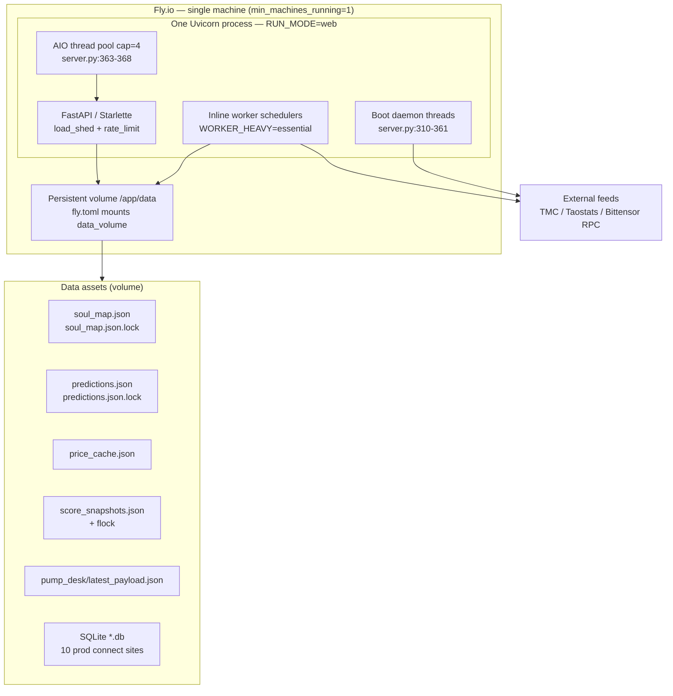
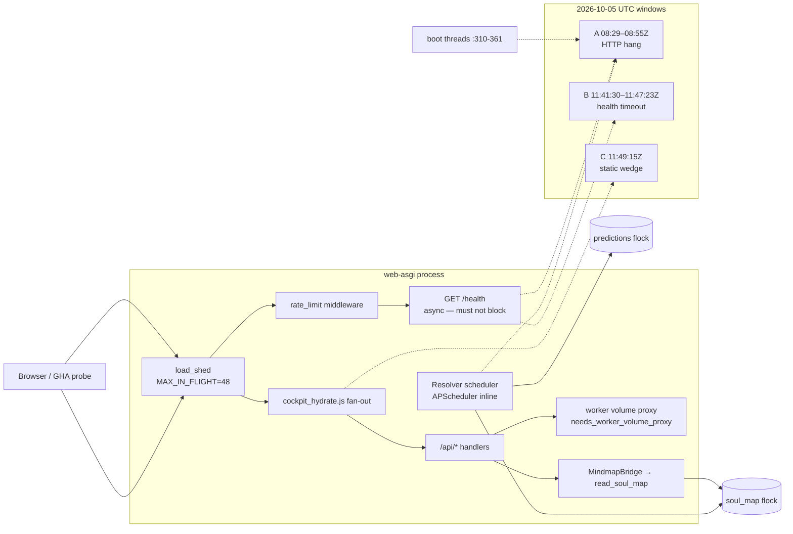

# Candidate matrix — live architecture map (L1 + L2)

**Pin:** `ce3d820013d45577333ac8aada8c0d9e97c54129`  
**PR:** [#1324](https://github.com/cryptoreporthub/subnet-dashboard/pull/1324)  
**Spec:** [`ARCHITECTURE-MAP-V1-SPEC.md`](ARCHITECTURE-MAP-V1-SPEC.md)

---

## Layer 1 — Topology

### Mermaid (deployment + data plane)

### L1 inventory table

| Asset | Path | Lock / notes |
|---|---|---|
| Soul map | `data/soul_map.json` | `soul_map.json.lock` — `_locked_soul_map_file` (`soul_map_io.py:48-69`) |
| Predictions | `data/predictions.json` | `predictions.json.lock` — `locked_predictions_file` (`predictions_store.py:35-59`) |
| Price cache | `data/price_cache.json` | RMW + flock in price fetch paths |
| Score snapshots | `data/score_snapshots.json` | `_locked_score_snapshot` 5s spin (`score_snapshots.py:121+`) |
| Pump desk payload | `data/pump_desk/latest_payload.json` | Cache for desk API; scheduler writes snapshots dir |
| SQLite | `data/*.db`, volume DB | **10 prod** `sqlite3.connect` sites (C5); see sub-table |
| Watchlist | **Dual default path (C2)** | `internal/freshness.py:24` → `config/watchlist.json`; `watchlist/store.py:11` → `data/watchlist.json` |

#### SQLite sub-table (10 prod connect sites, pin C5)

| # | File | Line(s) |
|---|---|---|
| 1 | `fetchers/_sqlite.py` | 28 |
| 2–6 | `internal/chain_client.py` | 41, 442, 452, 467, 479 |
| 7–9 | `internal/investigation/service.py` | 80, 94, 112 |
| 10 | `message_intel/models.py` | 32 |

*(+1 test site `tests/test_message_intel_reset.py:65` — not prod.)*

### L1 runtime facts (pin-verified)

| Fact | Anchor |
|---|---|
| Single web process owns inline worker | `fly.toml:10-14`, `:34-41`, `:127-131` |
| `RUN_MODE=web`, `WORKER_HEAVY=essential` | `fly.toml:33-41` |
| Boot threads (non-blocking lifespan) | `server.py:310-328` — emergency-prime, homepage-warm-boot, registry-name-sync, council-weight-rebalance |
| `AIO_WORKER_POOL_SIZE` default 4 | `server.py:363-368` |
| Volume mount | `fly.toml:129-131` → `/app/data` |
| Static mount | `server.py:510-512` — SMOKE-001 |

---

## Layer 2 — Request / data flow

### Mermaid (hydrate + persist + incidents)

### L2 flow table (selected nodes)

| Node | Execution context | Edge verbs | blocks_loop | Incident |
|---|---|---|---|---|
| Boot lifespan threads | boot-thread | starts async warm/sync work | unknown | A |
| `AIO_WORKER_POOL_SIZE=4` | web-asgi | caps default executor | yes (pool exhaust) | A, B |
| APScheduler jobs (`job_scheduler.py:12`) | inline-worker / ap-scheduler | schedules resolver, picks, pump | yes (sync work in job) | A |
| `GET /health` | web-asgi | reads minimal state | no (async handler) | B |
| Boot hydrate before first `/health` 200 | boot-thread + defer | `BOOT_DEFER_SECONDS=90` (`fly.toml:63`) warms after health window | unknown | A |
| `cockpit_hydrate.js` fan-out | client-hydrate | parallel `fetchJsonRetry` / EventSource | no (client) | C |
| `load_shed` / `rate_limit` | web-asgi | acquire / reject under load | no (shed) | B |
| `fetch_worker_json_sync` | web-asgi | sync RPC to volume proxy | yes | B |
| `MindmapBridge._load_from_disk` | web-asgi | **reads** soul_map via `read_soul_map` | holds-lock (read path) | A |
| `resolver._save_json` | inline-worker | **writes** predictions under `locked_predictions_file` | holds-lock | A |
| `write_soul_map` (scheduler) | inline-worker | **writes** soul_map; **swallows** at `:735-737` | swallows / unknown | A |
| `load_weights_for_ui` | web-asgi | proxy read; **`_proxy_degraded`** not 1.0 | no | — |
| StaticFiles `/static/*` | web-asgi | **reads** disk (47 template paths) | unknown (burst I/O) | C |

#### Client hydrate endpoints (`static/js/cockpit_hydrate.js` at pin)

Primary fan-out (non-exhaustive): `/api/subnets`, `/api/daily-pick`, `/api/daily-pick/weighed`, `/api/top-picks`, `/api/top-pick/hour`, `/api/top-pick/day`, `/api/simivision`, `/api/learning/stats`, `/api/learning-metrics`, `/api/pump-alerts`, `/api/cockpit/sections`, `/api/cockpit/stream` (SSE), `/api/signals`, `/api/alerts`, `/api/indicators-convergence`, `/api/portfolio/status`, `/api/letter/brain`, `/api/message-intel`, `/api/ops/evidence`, `/api/story-strip`, `/api/mindmap/trail`, `/api/backtest`, `/api/formula-lineage`, `/api/judges/{netuid}`, `/api/pick-explain/{netuid}`.

#### Lock domain boundary (correction embedded)

| Domain | Lock file | Writers |
|---|---|---|
| Predictions | `data/predictions.json.lock` | `resolver._save_json` (`resolver.py:215-216`), predictions_store |
| Soul map | `data/soul_map.json.lock` | `soul_map_io`, resolver_scheduler `write_soul_map`, MindmapBridge |

**Not the same flock** — concurrent predictions vs soul_map RMW can still contend on disk/CPU.

#### Pick action gate (correction embedded)

| Pick | HOLD? | Anchor |
|---|---|---|
| Hourly | **Yes** — empty universe `:86`; confidence/directional `:139` | `hourly_pick.py` |
| Daily | **No** — candidate action always `"long"` | `daily_pick.py:284` |

#### Config collision — cockpit picks registry cap (correction embedded)

| Env var | Default | Anchor | Notes |
|---|---|---|---|
| `COCKPIT_PICKS_REGISTRY_CAP` | **24** | `internal/cockpit/picks_snapshot.py:16` (`_REGISTRY_HOUR_CAP`) | Hour-cap for cockpit picks registry SSE snapshot. **Not** `COCKPIT_PICKS_REGISTRY_HOUR_CAP` (wrong name — see [`ARCHITECTURE-MAP-V1-SPEC.md`](ARCHITECTURE-MAP-V1-SPEC.md) embedded corrections). |

---

## Master table — all 26 claim_ids

| claim_id | layer | runtime_subsystem | code_anchor | data/asset | incident | disposition | review_status | map_provenance | verified_at_sha | evidence_tier | contradicted_by | campaign_ticket | execution_context | blocks_loop |
|---|---|---|---|---|---|---|---|---|---|---|---|---|---|---|
| C1-LEARNING-MIN-WEIGHT-001 | L1 | config-duplicate | `resolver.py` vs `weights.py` `_LEARNING_MIN_WEIGHT` | — | — | CONFIRMED | replit_pass | bundle | ce3d8200 | B | — | — | inline-worker | no |
| C1-MAX-SNAPSHOTS-001 | L1 | config-duplicate | `pump_tracker/core.py:60` vs `datastore/pump_tracker.py:600` | pump snapshots | — | CONFIRMED | pending | bundle | ce3d8200 | B | — | — | inline-worker | no |
| C10-PREVIEW-GRADED-HARDCODE-001 | L2 | ui-trust-label | preview tribunal_hero graded=443 | — | — | CONFIRMED | pending | bundle | ce3d8200 | B | — | — | web-asgi | no |
| C12-STATIC-PATH-COUNT-001 | L1+L2 | static-burst | `templates/` 47 `/static/*` refs; mount `server.py:510-512` | static/ | C | CONFIRMED | pending | live-matrix | ce3d8200 | B | — | Gemini task-279 | web-asgi | unknown |
| C13-CHECKPOINT-T1_5-001 | L2 | resolver-telemetry | resolver checkpoint t1_5 excluded from stage-sum | soul_map telemetry | — | CONFIRMED | pending | bundle | ce3d8200 | B | — | — | inline-worker | no |
| C2-HOMEPAGE-CACHE-001 | L1 | config-divergence | `server.py` `_CACHE_PATHS=60` vs module 45 | homepage shell cache | — | CONFIRMED | replit_pass | bundle | ce3d8200 | B | — | — | web-asgi | no |
| C2-WATCHLIST-PATH-001 | L1 | config-divergence | `freshness.py:24` config/ vs `store.py:11` data/ | watchlist.json | — | CONFIRMED | pending | live-matrix | ce3d8200 | B | — | — | volume-rmw | no |
| C2-WORKER-PEER-TIMEOUT-001 | L1 | config-divergence | worker_proxy=4 vs worker_peer=12 | — | — | CONFIRMED | pending | bundle | ce3d8200 | B | — | — | worker-proxy | no |
| C3-DATASTORE-PUMP-DEAD-001 | L1 | dead-code | `datastore/pump_tracker.py` unreferenced | — | — | CONFIRMED | pending | bundle | ce3d8200 | B | — | — | — | no |
| C4-FLOCK-SPINLOCK-001 | L1+L2 | persist-rmw | `soul_map_io.py:48-69`; score_snapshots; daily_pick_engine | *.lock files | A | CONFIRMED | pending | live-matrix | ce3d8200 | B | — | issue #1113 | volume-rmw | yes |
| C4-REVIVED-LATCH-001 | L2 | stall-guard | `loop_stall_guard.py:144` revived latch never reset | — | A | CONFIRMED | pending | f-items-map | ce3d8200 | B | — | Ditto 67d91e97 | inline-worker | unknown |
| C5-SQLITE-INVENTORY-001 | L1 | state-ownership | 10 prod `sqlite3.connect` sites | SQLite dbs | — | CONFIRMED | pending | live-matrix | ce3d8200 | B | — | — | volume-rmw | no |
| C6-WORKER-HEAVY-ESSENTIAL-001 | L1 | boot-arming | `fly.toml:41` WORKER_HEAVY=essential skips live_subnets | — | — | BY-DESIGN | replit_pass | live-matrix | ce3d8200 | B | — | — | inline-worker | no |
| C7-READINESS-GRADED-FALLBACK-001 | L2 | ops-readiness | `/api/ops/readiness` graded fallback chain | — | — | CONFIRMED | replit_pass | bundle | ce3d8200 | B | — | — | web-asgi | no |
| C8-BARE-EXCEPT-PASS-001 | L1+L2 | silent-failure | AST 299 bare `except: pass` | — | A | CONFIRMED | pending | bundle | ce3d8200 | B | — | — | web-asgi | swallows |
| C8-RESOLVER-PERSIST-SWALLOW-001 | L2 | persist-rmw | `resolver_scheduler.py:735-737` write_soul_map swallowed | soul_map.json | A | CONFIRMED | pending | live-matrix | ce3d8200 | B | SMOKE-002 | — | inline-worker | swallows |
| C9-TOP-SCORING-UNIVERSE-001 | L1 | config-divergence | `server.py=20` vs council `=40` | — | — | CONFIRMED | pending | bundle | ce3d8200 | B | — | — | web-asgi | no |
| STOP-RULE-SAMPLE-1 | L1 | coverage | stratified sample 1 — no new classes | — | — | REFUTED | pending | bundle | ce3d8200 | B | — | — | — | no |
| STOP-RULE-SAMPLE-2 | L1 | coverage | stratified sample 2 — no new classes | — | — | REFUTED | pending | bundle | ce3d8200 | B | — | — | — | no |
| SMOKE-001 | L1+L2 | static-serve | `server.py:510-512` StaticFiles `/static` | static/ | C | CONFIRMED | replit_pass | live-matrix | ce3d8200 | B | — | smoke-gate | web-asgi | unknown |
| SMOKE-002 | L2 | persist-rmw | `resolver_scheduler.py:735-737` except pass on write_soul_map | soul_map.json | A | CONFIRMED | replit_pass | live-matrix | ce3d8200 | B | C8-RESOLVER-PERSIST-SWALLOW-001 | smoke-gate | inline-worker | swallows |
| SMOKE-003 | L2 | deploy-pin | live `/version` SHA equals pin | — | — | CONFIRMED | replit_modify_pending | bundle | ce3d8200 | B | — | smoke-gate | external-probe | no |
| L2-INC-A-001 | L2 | incident | event-loop wedge 08:29–08:55Z; recovery NOT_OBSERVABLE | — | A | UNKNOWN | replit_modify_pending | bundle | ce3d8200 | B | — | Ditto 93d36426 | web-asgi | unknown |
| L2-INC-B-001 | L2 | incident | connection freeze 11:41:30–11:47:23Z | — | B | UNKNOWN | replit_pass | bundle | ce3d8200 | B | — | Gemini task-279 | web-asgi | unknown |
| L2-INC-C-001 | L2 | incident | static wedge 11:49:15Z | static/ | C | UNKNOWN | replit_pass | bundle | ce3d8200 | B | — | Gemini task-279 | client-hydrate | unknown |
| L2-PERSIST-HYDRATE-001 | L2 | persist-hydrate-wedge | persist/hydrate may block ASGI during A–C | soul_map, predictions, hydrate paths | A,B,C | UNKNOWN | replit_modify_pending | live-matrix | ce3d8200 | B | — | audit brief § action item | boot-thread + inline-worker | yes |

**Review_status source of truth:** Replit PR comments on #1324. MC mirrors into `claims.json` after comment.

**SimiVision stack (L3 placeholder):** council weights → daily/hour picks → predictions/resolver → grading/trust → cockpit hydrate. Full hazard edges deferred to L3 batch.

---

## Edge verb legend

| Verb | Meaning |
|---|---|
| reads | load without lock or with shared read |
| writes | mutating persist |
| holds-lock | `fcntl.flock` spin up to 5s |
| swallows | exception suppressed (`except: pass` / `except Exception: pass`) |
| blocks | synchronous work on ASGI thread / unbounded wait |

---

*Generated by Mission Control worker — architecture map Phase 1 (L1+L2). L3 hazard table + L4 timeline annotations follow Batch 2 close.*
