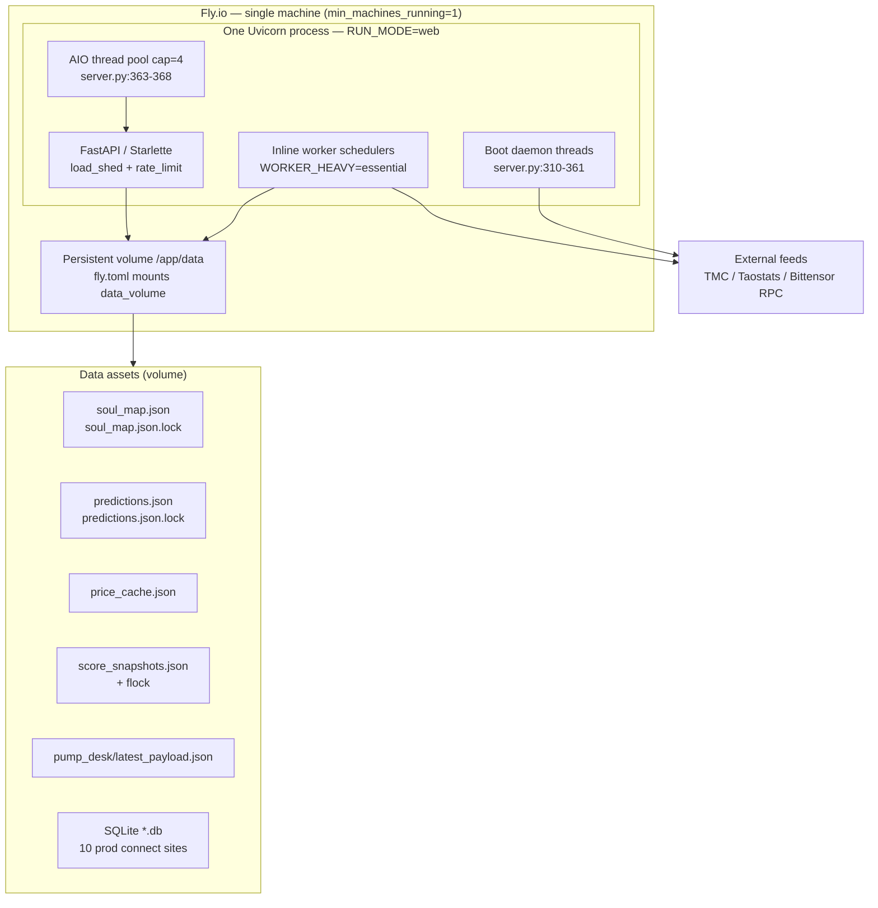
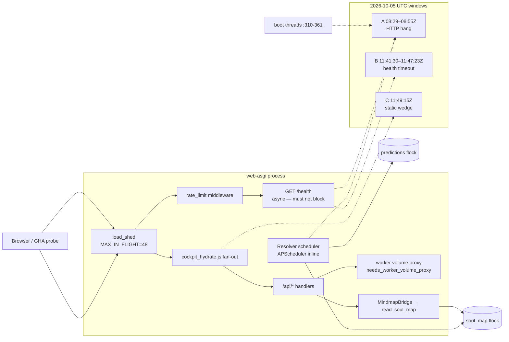
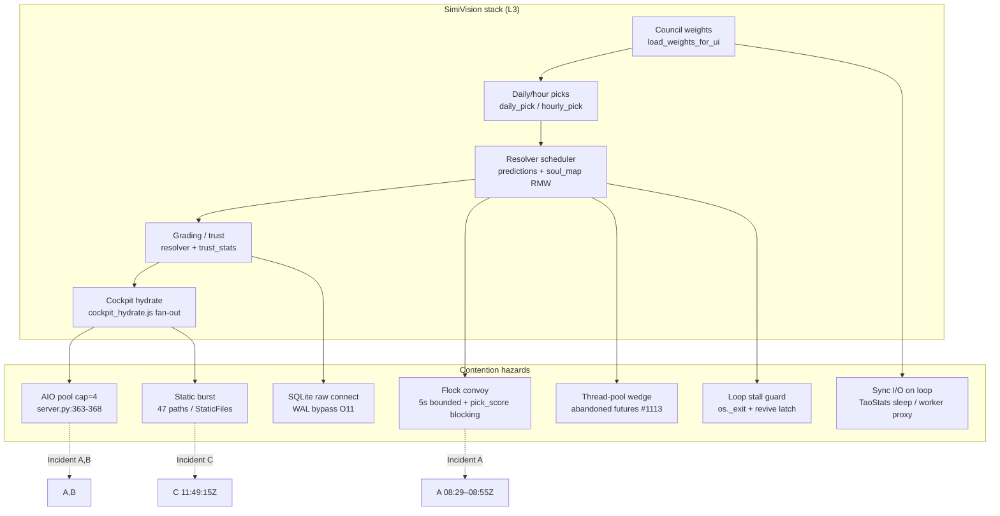

# Candidate matrix — live architecture map (L1–L4)

**Pin:** `ce3d820013d45577333ac8aada8c0d9e97c54129`  
**PR:** [#1324](https://github.com/cryptoreporthub/subnet-dashboard/pull/1324)  
**Spec:** [`ARCHITECTURE-MAP-V1-SPEC.md`](ARCHITECTURE-MAP-V1-SPEC.md)

---

## Layer 1 — Topology

### Mermaid (deployment + data plane)



### L1 inventory table

| Asset | Path | Lock / notes |
|---|---|---|
| Soul map | `data/soul_map.json` | `soul_map.json.lock` — `_locked_soul_map_file` (`soul_map_io.py:48-69`) |
| Predictions | `data/predictions.json` | `predictions.json.lock` — `locked_predictions_file` (`predictions_store.py:35-59`) |
| Price cache | `data/price_cache.json` | RMW + flock in price fetch paths |
| Score snapshots | `data/score_snapshots.json` | `_locked_score_snapshot` 5s spin (`score_snapshots.py:121+`) |
| Pump desk payload | `data/pump_desk/latest_payload.json` | Cache for desk API; scheduler writes snapshots dir |
| SQLite | `data/*.db`, volume DB | **10 prod** `sqlite3.connect` sites (C5); see sub-table |
| Watchlist | **Dual default path (C2)** | `internal/freshness.py:24` → `config/watchlist.json`; `watchlist/store.py:11` → `data/watchlist.json` |

#### SQLite sub-table (10 prod connect sites, pin C5)

| # | File | Line(s) |
|---|---|---|
| 1 | `fetchers/_sqlite.py` | 28 |
| 2–6 | `internal/chain_client.py` | 41, 442, 452, 467, 479 |
| 7–9 | `internal/investigation/service.py` | 80, 94, 112 |
| 10 | `message_intel/models.py` | 32 |

*(+1 test site `tests/test_message_intel_reset.py:65` — not prod.)*

### L1 runtime facts (pin-verified)

| Fact | Anchor |
|---|---|
| Single web process owns inline worker | `fly.toml:10-14`, `:34-41`, `:127-131` |
| `RUN_MODE=web`, `WORKER_HEAVY=essential` | `fly.toml:33-41` |
| Boot threads (non-blocking lifespan) | `server.py:310-328` — emergency-prime, homepage-warm-boot, registry-name-sync, council-weight-rebalance |
| `AIO_WORKER_POOL_SIZE` default 4 | `server.py:363-368` |
| Volume mount | `fly.toml:129-131` → `/app/data` |
| Static mount | `server.py:510-512` — SMOKE-001 |

---

## Layer 2 — Request / data flow

### Mermaid (hydrate + persist + incidents)



### L2 flow table (selected nodes)

| Node | Execution context | Edge verbs | blocks_loop | Incident |
|---|---|---|---|---|
| Boot lifespan threads | boot-thread | starts async warm/sync work | unknown | A |
| `AIO_WORKER_POOL_SIZE=4` | web-asgi | caps default executor | yes (pool exhaust) | A, B |
| APScheduler jobs (`job_scheduler.py:12`) | inline-worker / ap-scheduler | schedules resolver, picks, pump | yes (sync work in job) | A |
| `GET /health` | web-asgi | reads minimal state | no (async handler) | B |
| Boot hydrate before first `/health` 200 | boot-thread + defer | `BOOT_DEFER_SECONDS=90` (`fly.toml:63`) warms after health window | unknown | A |
| `cockpit_hydrate.js` fan-out | client-hydrate | parallel `fetchJsonRetry` / EventSource | no (client) | C |
| `load_shed` / `rate_limit` | web-asgi | acquire / reject under load | no (shed) | B |
| `fetch_worker_json_sync` | web-asgi | sync RPC to volume proxy | yes | B |
| `MindmapBridge._load_from_disk` | web-asgi | **reads** soul_map via `read_soul_map` | holds-lock (read path) | A |
| `resolver._save_json` | inline-worker | **writes** predictions under `locked_predictions_file` | holds-lock | A |
| `write_soul_map` (scheduler) | inline-worker | **writes** soul_map; **swallows** at `:735-737` | swallows / unknown | A |
| `load_weights_for_ui` | web-asgi | proxy read; **`_proxy_degraded`** not 1.0 | no | — |
| StaticFiles `/static/*` | web-asgi | **reads** disk (47 raw / 46 stripped template paths) | unknown (burst I/O) | C |

#### Client hydrate endpoints (`static/js/cockpit_hydrate.js` at pin)

Primary fan-out (non-exhaustive): `/api/subnets`, `/api/daily-pick`, `/api/daily-pick/weighed`, `/api/top-picks`, `/api/top-pick/hour`, `/api/top-pick/day`, `/api/simivision`, `/api/learning/stats`, `/api/learning-metrics`, `/api/pump-alerts`, `/api/cockpit/sections`, `/api/cockpit/stream` (SSE), `/api/signals`, `/api/alerts`, `/api/indicators-convergence`, `/api/portfolio/status`, `/api/letter/brain`, `/api/message-intel`, `/api/ops/evidence`, `/api/story-strip`, `/api/mindmap/trail`, `/api/backtest`, `/api/formula-lineage`, `/api/judges/{netuid}`, `/api/pick-explain/{netuid}`.

#### Lock domain boundary (correction embedded)

| Domain | Lock file | Writers |
|---|---|---|
| Predictions | `data/predictions.json.lock` | `resolver._save_json` (`resolver.py:215-216`), predictions_store |
| Soul map | `data/soul_map.json.lock` | `soul_map_io`, resolver_scheduler `write_soul_map`, MindmapBridge |

**Not the same flock** — concurrent predictions vs soul_map RMW can still contend on disk/CPU.

#### Pick action gate (correction embedded)

| Pick | HOLD? | Anchor |
|---|---|---|
| Hourly | **Yes** — empty universe `:86`; confidence/directional `:139` | `hourly_pick.py` |
| Daily | **No** — candidate action always `"long"` | `daily_pick.py:284` |

#### Config collision — cockpit picks registry cap (correction embedded)

| Env var | Default | Anchor | Notes |
|---|---|---|---|
| `COCKPIT_PICKS_REGISTRY_CAP` | **24** | `internal/cockpit/picks_snapshot.py:16` (`_REGISTRY_HOUR_CAP`) | Hour-cap for cockpit picks registry SSE snapshot. **Not** `COCKPIT_PICKS_REGISTRY_HOUR_CAP` (wrong name — see [`ARCHITECTURE-MAP-V1-SPEC.md`](ARCHITECTURE-MAP-V1-SPEC.md) embedded corrections). |

---

## Master table — all 26 claim_ids

Open-question cross-refs: [`ledger/open-questions-closure.md`](open-questions-closure.md) (F02 O1–O18 closure at pin).

| claim_id | layer | runtime_subsystem | code_anchor | data/asset | incident | disposition | review_status | map_provenance | verified_at_sha | evidence_tier | contradicted_by | campaign_ticket | open_questions | execution_context | blocks_loop |
|---|---|---|---|---|---|---|---|---|---|---|---|---|---|---|---|
| C1-LEARNING-MIN-WEIGHT-001 | L1 | config-duplicate | `resolver.py` vs `weights.py` `_LEARNING_MIN_WEIGHT` | — | — | CONFIRMED | replit_pass | bundle | ce3d8200 | B | — | — | — | inline-worker | no |
| C1-MAX-SNAPSHOTS-001 | L1 | config-duplicate | `pump_tracker/core.py:60` vs `datastore/pump_tracker.py:600` | pump snapshots | — | CONFIRMED | replit_pass | bundle | ce3d8200 | B | — | — | — | inline-worker | no |
| C10-PREVIEW-GRADED-HARDCODE-001 | L2 | ui-trust-label | preview tribunal_hero graded=443 | — | — | CONFIRMED | replit_pass | bundle | ce3d8200 | B | — | — | — | web-asgi | no |
| C12-STATIC-PATH-COUNT-001 | L1+L2 | static-burst | `templates/` 47 raw / 46 stripped `/static/*` refs; mount `server.py:510-512` | static/ | C | CONFIRMED | replit_pass | live-matrix | ce3d8200 | B | — | Gemini task-279 | — | web-asgi | unknown |
| C13-CHECKPOINT-T1_5-001 | L2 | resolver-telemetry | resolver checkpoint t1_5 excluded from stage-sum | soul_map telemetry | — | CONFIRMED | replit_pass | bundle | ce3d8200 | B | — | — | O2 | inline-worker | no |
| C2-HOMEPAGE-CACHE-001 | L1 | config-divergence | `server.py` `_CACHE_PATHS=60` vs module 45 | homepage shell cache | — | CONFIRMED | replit_pass | bundle | ce3d8200 | B | — | — | — | web-asgi | no |
| C2-WATCHLIST-PATH-001 | L1 | config-divergence | `freshness.py:24` config/ vs `store.py:11` data/ | watchlist.json | — | CONFIRMED | replit_pass | live-matrix | ce3d8200 | B | — | — | — | volume-rmw | no |
| C2-WORKER-PEER-TIMEOUT-001 | L1 | config-divergence | worker_proxy=4 vs worker_peer=12 | — | — | CONFIRMED | replit_pass | bundle | ce3d8200 | B | — | — | — | worker-proxy | no |
| C3-DATASTORE-PUMP-DEAD-001 | L1 | dead-code | `datastore/pump_tracker.py` unreferenced | — | — | CONFIRMED | replit_pass | bundle | ce3d8200 | B | — | — | — | — | no |
| C4-FLOCK-SPINLOCK-001 | L1+L2+L3 | persist-rmw | bounded flock polling/retry (5s): soul_map_io, score_snapshots, daily_pick_engine, predictions_store, price_fetcher; counterexample: `pick_score_cache.py:104` blocking LOCK_EX | *.lock files | A | CONFIRMED | replit_pass | live-matrix | ce3d8200 | B | — | issue #1113 | O1, O12 | volume-rmw | yes |
| C4-REVIVED-LATCH-001 | L2 | stall-guard | `loop_stall_guard.py:144` revived latch never reset | — | A | CONFIRMED | replit_pass | f-items-map | ce3d8200 | B | — | Ditto 67d91e97 | O12 | inline-worker | unknown |
| C5-SQLITE-INVENTORY-001 | L1 | state-ownership | 10 prod `sqlite3.connect` sites | SQLite dbs | — | CONFIRMED | replit_pass | live-matrix | ce3d8200 | B | — | — | O11 | volume-rmw | no |
| C6-WORKER-HEAVY-ESSENTIAL-001 | L1 | boot-arming | `fly.toml:41` WORKER_HEAVY=essential skips live_subnets | — | — | BY-DESIGN | replit_pass | live-matrix | ce3d8200 | B | — | — | — | inline-worker | no |
| C7-READINESS-GRADED-FALLBACK-001 | L2 | ops-readiness | `/api/ops/readiness` graded fallback chain | — | — | CONFIRMED | replit_pass | bundle | ce3d8200 | B | — | — | O17, O18 | web-asgi | no |
| C8-BARE-EXCEPT-PASS-001 | L1+L2 | silent-failure | AST 299 typed `except+pass` (bare=0) | — | A | CONFIRMED | replit_pass | bundle | ce3d8200 | B | — | — | O14 | web-asgi | swallows |
| C8-RESOLVER-PERSIST-SWALLOW-001 | L2 | persist-rmw | `resolver_scheduler.py:735-737` write_soul_map swallowed | soul_map.json | A | CONFIRMED | replit_pass | live-matrix | ce3d8200 | B | SMOKE-002 | — | — | inline-worker | swallows |
| C9-TOP-SCORING-UNIVERSE-001 | L1 | config-divergence | `server.py=20` vs council `=40` | — | — | CONFIRMED | replit_pass | bundle | ce3d8200 | B | — | — | O8 (partial; **bounded** WS5b) | web-asgi | no |
| STOP-RULE-SAMPLE-1 | L1 | coverage | stratified sample 1 — no new classes (C4/C10 annotated) | — | — | CONFIRMED | replit_pass | bundle | ce3d8200 | B | — | — | — | — | no |
| STOP-RULE-SAMPLE-2 | L1 | coverage | stratified sample 2 — no new classes (2 C8-typed hits: specialists:433, trace/store:51) | — | — | CONFIRMED | replit_pass | bundle | ce3d8200 | B | — | — | — | — | no |
| SMOKE-001 | L1+L2 | static-serve | `server.py:510-512` StaticFiles `/static` | static/ | C | CONFIRMED | replit_pass | live-matrix | ce3d8200 | B | — | smoke-gate | — | web-asgi | unknown |
| SMOKE-002 | L2 | persist-rmw | `resolver_scheduler.py:735-737` except pass on write_soul_map | soul_map.json | A | CONFIRMED | replit_pass | live-matrix | ce3d8200 | B | C8-RESOLVER-PERSIST-SWALLOW-001 | smoke-gate | — | inline-worker | swallows |
| SMOKE-003 | L2+L4 | deploy-pin | historical + live `/version` receipts match pin (live CONFIRMED 2026-10-06T03:28:50Z) | — | — | CONFIRMED | replit_pass | bundle | ce3d8200 | B | — | smoke-gate | — | external-probe | no |
| L2-INC-A-001 | L2+L4 | incident | GHA 000000 08:44Z; no recycle; InstantBailout refutes thread-pool-only; WS1 current live CONFIRMED | — | A | BOUNDED_UNKNOWN | replit_pass | bundle | ce3d8200 | B | — | Ditto 93d36426 + WS1+WS2 | — | web-asgi | unknown |
| L2-INC-B-001 | L2 | incident | recycle 11:45:48Z CONFIRMED; Gemini 48-probe UNVERIFIED | — | B | BOUNDED_UNKNOWN | replit_pass | bundle | ce3d8200 | B | — | Gemini task-279 + WS2 | — | web-asgi | unknown |
| L2-INC-C-001 | L2 | incident | queuing-starvation REFUTED audit-time; partial bailout allowlist 4 files | static/ | C | BOUNDED_UNKNOWN | replit_pass | bundle | ce3d8200 | B | — | Gemini task-279 + WS2 | — | client-hydrate | unknown |
| L2-PERSIST-HYDRATE-001 | L2+L3 | persist-hydrate-wedge | direct web ASGI block REFUTED; flock≤5s + VM I/O PLAUSIBLE | soul_map, predictions, hydrate paths | A,B,C | BOUNDED_UNKNOWN | replit_pass | live-matrix | ce3d8200 | B | — | audit brief § action item + WS2 | O2 (ctx), O5 (**bounded** WS5b) | boot-thread + inline-worker | yes |

**Review_status source of truth:** Replit PR comments on #1324. MC mirrors into `claims.json` after comment.

---

## Layer 3 — Hazard / contention (failure modes)

Cross-cutting risks mapped to indexed bundles, F02 scope ([`f02-runtime-audit-scope.md`](../f02-runtime-audit-scope.md)), and F02 open-questions closure ([`open-questions-closure.md`](open-questions-closure.md); Ditto `67d91e97`, `07a7021d`).

### Mermaid (hazard edges)



### L3 hazard master table (20 rows)

| row_id | failure_mode | claim_id / bounded-unknown | code_anchor | data/asset | incident | disposition | evidence_bundle | open_questions | cross_cutting_risk | blocks_loop |
|---|---|---|---|---|---|---|---|---|---|---|
| HZ-FLOCK-CONVOY | Bounded flock convoy on persist paths (5s spin) | `C4-FLOCK-SPINLOCK-001` | soul_map_io, score_snapshots, daily_pick_engine, predictions_store, price_fetcher | `*.lock` | A | CONFIRMED | [`findings/C4-FLOCK-SPINLOCK-001.json`](../findings/C4-FLOCK-SPINLOCK-001.json) | O1 (lock-wait in 101s) | Resolver + web share volume; convoy delays ASGI reads | yes |
| HZ-DUAL-LOCK-DOMAIN | Predictions flock ≠ soul_map flock — CPU/disk contention still possible | *(embedded correction)* | `resolver.py:215-216` vs `soul_map_io.py:48-69` | predictions + soul_map locks | A | CONFIRMED | L2 flow table + [`C8-RESOLVER-PERSIST-SWALLOW-001`](../findings/C8-RESOLVER-PERSIST-SWALLOW-001.json) | F02 q6 | Two RMW domains on one 1GB VM | yes |
| HZ-PICK-SCORE-BLOCKING | Blocking LOCK_EX counterexample (no timeout) | `C4-FLOCK-SPINLOCK-001` (counterexample) | `pick_score_cache.py:104` | pick_score_cache.json | — | CONFIRMED | [`findings/C4-FLOCK-SPINLOCK-001.json`](../findings/C4-FLOCK-SPINLOCK-001.json) | — | Unbounded flock wait on scoring path | yes |
| HZ-THREAD-POOL-ABANDON | Resolver cycle timeout abandons pool future; worker may linger | `BU-L3-O1-THREAD-CENSUS` | `score_snapshots.py:307-322`; `resolver_scheduler.py:828,915` | — | A,B | UNKNOWN | issue [#1113](https://github.com/cryptoreporthub/subnet-dashboard/issues/1113) + [`f-items-prior-evidence-map-2026-10-03.md`](../f-items-prior-evidence-map-2026-10-03.md) §Gemini-2 | **O1**, F02 q7 | Zombie threads / memory on 1GB VM — count unmeasured | yes |
| HZ-AIO-POOL-EXHAUST | Default executor capped at 4; hydrate fan-out competes | `BU-L3-AIO-POOL-004` | `server.py:363-368` `AIO_WORKER_POOL_SIZE` | — | A,B | CONFIRMED | L2 flow + [`L2-INC-A-001`](../findings/L2-INC-A-001.json) | O2 (**closed**) | Pool exhaustion stalls async handlers | yes |
| HZ-STATIC-BURST | 47 raw static refs; burst load vs API on one process | `C12-STATIC-PATH-COUNT-001`, `SMOKE-001` | `server.py:510-512`; templates | static/ | C | CONFIRMED | [`C12-*`](../findings/C12-STATIC-PATH-COUNT-001.json), [`SMOKE-001`](../findings/SMOKE-001.json) | Gemini task-279 | Static I/O starves event loop during hydrate | unknown |
| HZ-PERSIST-HYDRATE-WEDGE | Persist/hydrate MAY block ASGI during incidents (hypothesis) | `L2-PERSIST-HYDRATE-001` | soul_map_io flock; resolver_scheduler persist | soul_map, predictions | A,B,C | UNKNOWN | [`findings/L2-PERSIST-HYDRATE-001.json`](../findings/L2-PERSIST-HYDRATE-001.json) | F02 q5–q6, O2 (**closed**) | Single-process wedge under load | yes |
| HZ-SOUL-MAP-SWALLOW | write_soul_map failures silently swallowed | `C8-RESOLVER-PERSIST-SWALLOW-001`, `SMOKE-002` | `resolver_scheduler.py:735-737` | soul_map.json | A | CONFIRMED | [`C8-RESOLVER-*`](../findings/C8-RESOLVER-PERSIST-SWALLOW-001.json) | F02 q6 | Silent data loss masks stall symptoms | swallows |
| HZ-REVIVE-LATCH-BURN | `revived` latch set once, never reset — later stale episodes skip revive | `C4-REVIVED-LATCH-001` | `loop_stall_guard.py:144,197-217` | — | A | CONFIRMED | [`findings/C4-REVIVED-LATCH-001.json`](../findings/C4-REVIVED-LATCH-001.json) | F02 q1, Ditto 67d91e97 | Guard walks to strike-2 without second revive attempt | unknown |
| HZ-STALL-GUARD-EXIT | `os._exit(1)` on strike-2; skips finally/atexit | `BU-L3-F02-Q1-GUARD-EXIT` | `loop_stall_guard.py:217` | — | A | PARTIAL | [`f02-runtime-audit-scope.md`](../f02-runtime-audit-scope.md) §2a q1–q6 + registry v1.7 | **F02 q1–q6** | Hard kill mid-persist; temp-file debris NOT_OBSERVABLE | yes |
| HZ-TAOSTATS-SYNC-SLEEP | TaoStats rate limit sleeps synchronously on event loop | `BU-L3-O9-TAOSTATS-WEDGE` | `taostats_client.py:92-101` (`time.sleep`) | — | B | CONFIRMED | Ditto C2 + [`open-questions-closure.md`](open-questions-closure.md) **O10** | **O10** | `/health` blocked for minutes → Fly recycle | yes |
| HZ-SQLITE-WAL-BYPASS | Raw `sqlite3.connect` bypasses WAL helper | `BU-L3-O11-SQLITE-WAL`, `C5-SQLITE-INVENTORY-001` | `chain_client.py:41,442+`; `investigation/service.py:80+` | volume *.db | — | CONFIRMED | [`C5-*`](../findings/C5-SQLITE-INVENTORY-001.json) + Ditto **O11** | **O11**, F02 scope §6 | `database is locked` on shared volume | yes |
| HZ-UNLOCKED-SAFE-WRITE | `safe_write_json` whole-blob RMW without flock (F04-class) | `BU-L3-F02-UNLOCKED-JSON` | `file_utils.py:41-61`; 10 caller sites | JSON blobs | — | CONFIRMED | [`f-items-prior-evidence-map`](../f-items-prior-evidence-map-2026-10-03.md) Gemini-4 | F02 q6, F04 | Last-writer-wins lost update | no |
| HZ-WORKER-OVERLAP | Entrypoint kill+restart may overlap inline worker processes | `BU-L3-O13-WORKER-OVERLAP` | `fly_web_entrypoint.sh:28,51-56` | — | B | UNKNOWN | Ditto **O13** + F02 scope §2a q3 | **O13** | Double writer on `/app/data` volume | yes |
| HZ-SIMIVISION-CHAIN | End-to-end stack hazard: weights→picks→resolver→trust→hydrate | `BU-L3-SIMIVISION-STACK` | council/*, picks, resolver_scheduler, trust_stats, cockpit_hydrate.js | soul_map, predictions, caches | A,B,C | UNKNOWN | L3 mermaid + 26 claim cross-refs | O8 (cardinality) | One slow stage stalls entire cockpit | yes |
| HZ-CONFIG-COLLISION | Duplicate defaults change runtime behavior silently | `C1-*`, `C2-*`, `C9-*` | see L1 master rows | various | — | CONFIRMED | respective `findings/*.json` | F02 q8–q11 | Wrong module default wins at import/call time | no |
| HZ-SILENT-FAILURE-SURFACE | 299 typed `except+pass` handlers hide faults | `C8-BARE-EXCEPT-PASS-001` | AST inventory at pin | — | A | CONFIRMED | [`findings/C8-BARE-EXCEPT-PASS-001.json`](../findings/C8-BARE-EXCEPT-PASS-001.json) | O14 (**closed**) | Incidents A–C mechanism opaque | swallows |
| HZ-PROXY-DEGRADED | Worker volume proxy failure → `_proxy_degraded`, not learned weights | *(embedded correction)* | `weights.py:542-560` | council weights | — | BY-DESIGN | ARCHITECTURE-MAP embedded corrections | — | UI may show stale/degraded council state | no |
| HZ-HEALTH-RECYCLE | Fly health check timeout under load triggers machine recycle | `BU-L3-FLY-HEALTH-RECYCLE` | `fly.toml:25-30` grace 90s, timeout 5s | — | B | CONFIRMED | [`L2-INC-B-001`](../findings/L2-INC-B-001.json) + [`incidents.json`](incidents.json) | Gemini task-279 | Symptom≠root-cause; correlates with AIO/sync wedge | unknown |
| HZ-SCORE-SNAPSHOT-TIMEOUT | 480s write timeout vs abandoned future (#1113 class) | `BU-L3-ISSUE-1113-WRITE-TIMEOUT` | `fly.toml:83`; `score_snapshots.py:307-322` | score_snapshots.json | A | CONFIRMED | issue #1113 + [`C4-FLOCK-SPINLOCK-001`](../findings/C4-FLOCK-SPINLOCK-001.json) | **O1**, F02 q5 | Long write + abandon → lingering worker | yes |

#### SimiVision stack hazard detail (5 nodes)

| stack_node | upstream | downstream hazard | claim_ids | blocks_loop |
|---|---|---|---|---|
| Council weights | proxy / soul_map read | `_proxy_degraded`; CAS conflicts (F04 fixed same-process) | C1-LEARNING-MIN-WEIGHT-001 | no |
| Picks | weights + universe | Daily always-long vs hourly HOLD; cap collisions C9 | C9-TOP-SCORING-UNIVERSE-001, C10 | no |
| Resolver | picks + predictions flock | Mid-guard non-preemptive; persist swallow; pool abandon | C8-RESOLVER-*, C4-FLOCK-*, BU-L3-O1 | yes |
| Grading / trust | resolver stats | Readiness fallback chain; preview hardcode | C7-*, C10-* | no |
| Cockpit hydrate | all API fan-out | Static burst + AIO pool + TaoStats sync | C12, SMOKE-001, BU-L3-O9 | yes |

---

## Layer 4 — Timeline + env/config truth

Incident annotations on boot/health sequence; deployment-declared env vs code defaults per F02 §2b q8–q11. **Production runtime env values: NOT_OBSERVABLE** (F02 q12 / Gate C).

### Mermaid (boot + incidents timeline, 2026-10-05 UTC)

```mermaid
timeline
  title Boot sequence vs Incidents A/B/C (pin ce3d8200)
  section Boot (typical deploy)
    T+0s : entrypoint starts uvicorn + inline worker
    T+0–90s : BOOT_DEFER_SECONDS=90 defers heavy sync
    T+? : first GET /health 200 — timing NOT_OBSERVABLE
    T+90s+ : boot threads + inline schedulers arm
  section Incident A
    08:29–08:55Z : HTTP hang >15s — L2-INC-A-001 UNKNOWN
  section Incident B
    11:41:30–11:47:23Z : 48× health probe timeout — L2-INC-B-001
    11:46Z : machine lifecycle exit/restart (partial receipt)
  section Incident C
    11:49:15Z : / 200 but static wedge — L2-INC-C-001
  section Log gap
    08:29–12:24Z : app logs NOT_OBSERVABLE — buffer/API-401
```

### L4 boot / health sequence table (10 rows)

| row_id | phase | event | timestamp / window | claim_id | code_anchor | disposition | evidence | incident |
|---|---|---|---|---|---|---|---|---|
| TL-BOOT-ENTRY | boot | `fly_web_entrypoint.sh` spawns uvicorn + inline worker | T+0 deploy | `BU-L4-F02-Q4-PROCESS-MODEL` | `fly.toml:10-14`; entrypoint | CONFIRMED | F02 scope §2a q4 | — |
| TL-BOOT-DEFER | boot | Heavy subnet/resolver work deferred | T+0..90s | `BU-L4-BOOT-DEFER-90` | `fly.toml:62` `BOOT_DEFER_SECONDS=90` | CONFIRMED | L2 flow table | A |
| TL-BOOT-LIFESPAN | boot | Non-blocking daemon threads start | T+0 async | `BU-L4-BOOT-THREADS` | `server.py:310-361` | CONFIRMED | L1 facts | A |
| TL-BOOT-INLINE-WORKER | boot | Inline worker schedulers (essential mode) | T+0 | `C6-WORKER-HEAVY-ESSENTIAL-001` | `fly.toml:40-41`; `background_boot.py` | BY-DESIGN | [`findings/C6-*`](../findings/C6-WORKER-HEAVY-ESSENTIAL-001.json) | — |
| TL-HEALTH-WINDOW | boot | Fly grace_period before health failures count | first 90s | `BU-L4-FLY-GRACE-90` | `fly.toml:26` grace_period=90s | CONFIRMED | L4 mermaid | B |
| TL-HEALTH-FIRST-200 | boot | First `/health` 200 before hydrate complete | unknown | `BU-L4-HEALTH-FIRST-200` | `GET /health` async handler | NOT_OBSERVABLE | F02 q4; L2-PERSIST-HYDRATE hypothesis | A |
| TL-INC-A | incident | Event-loop wedge — HTTP hang | 08:29–08:55Z | `L2-INC-A-001` | GHA curl timeout @ 08:44Z | UNKNOWN | [`findings/L2-INC-A-001.json`](../findings/L2-INC-A-001.json) | A |
| TL-INC-B | incident | Connection freeze — health recycle | 11:41:30–11:47:23Z | `L2-INC-B-001` | lifecycle @ 11:46Z | UNKNOWN | [`findings/L2-INC-B-001.json`](../findings/L2-INC-B-001.json) | B |
| TL-INC-C | incident | Static asset wedge post-recovery | 11:49:15Z | `L2-INC-C-001` | browser static timeouts | UNKNOWN | [`findings/L2-INC-C-001.json`](../findings/L2-INC-C-001.json) | C |
| TL-LOG-GAP | boundary | Fly log buffer does not cover incident windows | 08:29–12:24Z | `BU-L4-LOG-GAP` | [`incidents.json`](incidents.json) `log_gap` | CONFIRMED | [`L2-PERSIST-HYDRATE-001`](../findings/L2-PERSIST-HYDRATE-001.json) | A,B,C |

### L4 env/config truth table (14 rows)

Termination-relevant and collision vars: **`fly.toml [env]`** vs **code default** at pin. Production effective values → `BU-L4-F02-Q12-PROD-ENV` (**NOT_OBSERVABLE**, Gate C).

| row_id | env_var | fly.toml value | code default (if unset) | code_anchor | claim_id | termination_relevant | collision_risk |
|---|---|---|---|---|---|---|---|
| ENV-RUN-MODE | `RUN_MODE` | `web` | `web` | `run_mode.py:9` | — | boot path selection | low |
| ENV-INLINE-WORKER | `INLINE_WORKER` | `1` | off | `run_mode.py:37` | `C6-*` | starts inline schedulers | low |
| ENV-WORKER-HEAVY | `WORKER_HEAVY` | `essential` | `essential` | `background_boot.py:448+` | `C6-WORKER-HEAVY-ESSENTIAL-001` | skips live_subnets sync | medium |
| ENV-BOOT-DEFER | `BOOT_DEFER_SECONDS` | `90` | (module-specific) | `fly.toml:62` | `BU-L4-BOOT-DEFER-90` | delays heavy boot vs `/health` | high |
| ENV-RESOLVER-CYCLE | `RESOLVER_CYCLE_TIMEOUT_SECONDS` | `360` | 180 (typical module) | `fly.toml:48`; resolver_scheduler | `BU-L3-ISSUE-1113` | abandon pool on timeout | high |
| ENV-SNAPSHOT-WRITE | `SCORE_SNAPSHOT_WRITE_TIMEOUT_SECONDS` | `480` | module default | `fly.toml:83` | #1113 | abandon write future | high |
| ENV-LIVE-SYNC | `LIVE_SUBNETS_SYNC_TIMEOUT_SECONDS` | `90` | module default | `fly.toml:60` | `L2-PERSIST-HYDRATE-001` | background sync wedge | medium |
| ENV-LOOP-STALL-KILL | `LOOP_STALL_GUARD_KILL` | *(silent — uses code default)* | `True` | `loop_stall_guard.py` | `BU-L3-F02-Q1-GUARD-EXIT` | **enables os._exit(1)** | high |
| ENV-HOMEPAGE-CACHE | `HOMEPAGE_SHELL_CACHE_SECONDS` | `60` | 45 module / 60 `_CACHE_PATHS` | `fly.toml:66`; `server.py` | `C2-HOMEPAGE-CACHE-001` | cache staleness | medium |
| ENV-TOP-SCORING | `TOP_SCORING_UNIVERSE` | *(unset in fly.toml)* | 20 server / 40 council | `server.py` vs council | `C9-TOP-SCORING-UNIVERSE-001` | scoring universe size | high |
| ENV-LEARNING-MIN | `_LEARNING_MIN_WEIGHT` | *(unset)* | 0.3 resolver / 0.1 weights | resolver vs weights | `C1-LEARNING-MIN-WEIGHT-001` | council weight floor | medium |
| ENV-WATCHLIST-PATH | `WATCHLIST_PATH` | *(unset)* | config/ vs data/ | freshness vs store | `C2-WATCHLIST-PATH-001` | wrong file silently | high |
| ENV-WORKER-PEER-TO | `WORKER_PEER_TIMEOUT_SECONDS` | *(unset)* | 4 proxy / 12 peer | worker_proxy vs peer | `C2-WORKER-PEER-TIMEOUT-001` | proxy false-negative | medium |
| ENV-PROD-VALUES | *(all runtime overrides)* | declared subset above | many unset → code wins | F02 §2b q8–q11 | `BU-L4-F02-Q12-PROD-ENV` | **NOT_OBSERVABLE** | Gate C boundary |

**Open-questions closure (WS5+WS5b):** full O1–O18 table in [`open-questions-closure.md`](open-questions-closure.md) — **4 closed, 14 bounded, 0 open** (O5/O8/O9 bounded 2026-10-06T03:36Z multi-method pass). Hazard cross-refs: O1→HZ-THREAD-POOL-ABANDON / HZ-SCORE-SNAPSHOT-TIMEOUT; O5→L2-PERSIST-HYDRATE-001 (boot wedge, bounded); O8→HZ-SIMIVISION-CHAIN (four-layer cardinality, bounded); O9 (id/netuid, bounded — prod 168/168 match); O10→HZ-TAOSTATS-SYNC-SLEEP; O11→HZ-SQLITE-WAL-BYPASS; O13→HZ-WORKER-OVERLAP; O14→HZ-SILENT-FAILURE-SURFACE; F02 §2 twelve questions→BU-L3-F02-* / BU-L4-* rows above.

---

## Edge verb legend

| Verb | Meaning |
|---|---|
| reads | load without lock or with shared read |
| writes | mutating persist |
| holds-lock | `fcntl.flock` spin up to 5s |
| swallows | exception suppressed (`except: pass` / `except Exception: pass`) |
| blocks | synchronous work on ASGI thread / unbounded wait |

---

*Mission Control unknowns-closure WS3+WS5 — L3 hazard (20 rows + 5 stack nodes) + L4 timeline (10 rows) + env truth (14 rows) + O1–O18 closure. Pin `ce3d820013d45577333ac8aada8c0d9e97c54129`; Replit gate 26/26 `replit_pass`.*
