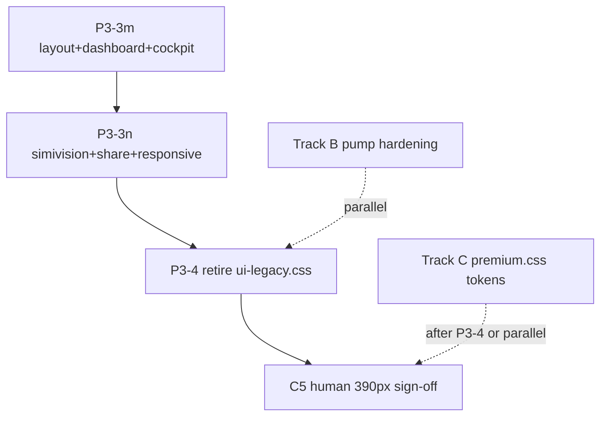

# Phase 3 — completion plan (thorough finish)

**Updated:** 2026-08-05  
**main:** `d94fe27` (#838 P3-3k + #839 P3-3l merged)  
**Owner cadence:** one slice → CI green → merge → Ditto STATUS → next slice

---

## Executive summary

| Track | Status | Remaining |
|-------|--------|-----------|
| **P3-0–P3-2** (tribunal tests, fonts, SEO) | ✅ **DONE** (#822–#825) | — |
| **P3-3** (`ui-legacy.css` purge) | **~74% by line count** (7,326 / 9,898 legacy lines removed) | **3 slices** + endgame |
| **Track B** Prod stability (pump API) | Known degradation since 2026-07-27 | **1 focused PR** |
| **Track C** Post-hero + human gates | 390px sign-off pending | **2–3 slices** |
| **Track D** Pre-existing pytest debt | ~72 modules on old APIs | Chip away; don't block CSS |

**North star:** Home spine + tribunal + desks + cockpit CSS live in **`ui.css` only**; `ui-legacy.css` retires from all templates (P3-4).

**Current sizes (post-#839):**

| File | Lines | Notes |
|------|------:|-------|
| `ui.css` | 10,477 | Canonical spine + all migrated P3-3a–l blocks |
| `ui-legacy.css` | 2,572 | Down from 9,898 pre-purge (**74% removed**) |

**Test gate (every CSS slice):**

```bash
source .venv/bin/activate
PYTHONPATH=. pytest tests/test_visual_upgrade_polish.py tests/test_endpoint_contract.py -q
# Expect: 52 polish + 145 contract (2026-08-05)
```

---

## What's done (P3-0 → P3-3l)

| Slice | PR | Scope |
|-------|-----|-------|
| P3-0 | #822 | Tribunal test realignment |
| P3-1 | #823 | Share/judge Space Grotesk |
| P3-2 | #824–#825 | NFA + `og:image` instant shells |
| P3-3a | #825 | Tribunal conf-state → `ui.css` |
| P3-3c | #827 | Horizon chips, pump chip, degraded notes |
| P3-3d | #828 | Dead k3-orb shell; claim identity + badges |
| P3-3e | #829 | K3 drawer / weight-nudge viz |
| P3-3f | #830 | Pump desk flagship + scan lane |
| P3-3g | #831 | Message-intel / SS-TG desk |
| P3-3h | #832 | Council home shell, trust banner, driver.js tour |
| P3-3i | #835 | Home drawers + §21 modules |
| P3-3j | #837 | Council-first composition |
| P3-3k | #838 | Weighing Room / Conviction Board |
| P3-3l | #839 | Premium cockpit / DEGEN protocol |

---

## Track A — Finish `ui-legacy.css` purge (P3-3m → P3-4)

Migrate **one section per PR**. After each slice: add `test_*_live_in_ui_css` + `test_legacy_no_*` guards in `test_visual_upgrade_polish.py`.

### Remaining legacy inventory

| Block | Lines | Slice |
|-------|------:|-------|
| `legacy layout` | ~194 | P3-3m-a |
| `legacy dashboard` | ~1,211 | P3-3m-b |
| `legacy cockpit` | ~234 | P3-3m-c |
| `legacy simivision` | ~269 | P3-3n-a |
| `legacy share_pages` | ~65 | P3-3n-b |
| `legacy responsive` | ~597 | P3-3n-c |
| **Total** | **~2,570** | |

---

### P3-3m — Layout + dashboard + cockpit (~1,639 lines)

**Branch:** `cursor/phase3-legacy-purge-m-6006`

| Sub-slice | Legacy span | Migrate | Gate |
|-----------|-------------|---------|------|
| **3m-a** | `legacy layout` | `.layout-grid`, `.wrap`, sticky header, section labels | `grep` templates for `.span-*` / `.layout-grid` |
| **3m-b** | `legacy dashboard` | Cards, KPI, tabs, tables, mindmap trail base, judge panels | Largest block — split PR if diff > ~800 lines |
| **3m-c** | `legacy cockpit` | `.cockpit-grid`, `.cockpit-card`, 12-section cards | `templates/partials/premium_cockpit.html` |

**Before moving:** `grep -r` each selector cluster in `templates/` + `static/js/` — **delete dead CSS** instead of migrating orphans.

**Risk:** Dashboard block overlaps migrated premium (P3-3l) on `.kpi-strip`, `.card` — dedupe on insert, don't double rules.

**Tests:** extend `test_phase_h_ui.py` section-order guards if selectors move; polish guards per sub-slice.

---

### P3-3n — SimiVision + share + responsive tail (~931 lines)

**Branch:** `cursor/phase3-legacy-purge-n-6006`

| Sub-slice | Legacy span | Migrate | Notes |
|-----------|-------------|---------|-------|
| **3n-a** | `legacy simivision` | Learning trail, judge council panel | `templates/simivision.html` still loads legacy |
| **3n-b** | `legacy share_pages` | §28–29 share chrome | `share/base_share.html` |
| **3n-c** | `legacy responsive` | Nav, volatility, 390px spine, soulmap 2×2 override | Merge with existing `ui.css` `@media` blocks; **remove** `#section-council .council-grid.soulmap-constellation` duplicate from legacy once in `ui.css` |

**Risk:** Responsive slice touches 390px rules — run `test_tribunal_hero_mobile_typography_at_390px` + manual 390px check after merge.

---

### P3-4 — Endgame: retire `ui-legacy.css`

**Branch:** `cursor/phase3-retire-legacy-css-6006`

1. `ui-legacy.css` empty or <100 lines of compat stubs.
2. Remove `<link ui-legacy.css>` from:
   - `templates/base.html`
   - `templates/share/base_share.html`
   - `templates/judge_council.html`
   - `templates/simivision.html`
3. Update `test_phase_h_ui.py`, `test_frontend_audit_cascade.py` (driver CDN before `ui.css` order).
4. Delete file or leave 1-line stub for one release cycle.
5. Post-merge: `./scripts/babysit_phase.sh sprint` on prod.

**Done when:** zero `<link … ui-legacy.css>` in repo + polish guards assert legacy file absent or stub-only.

---

## Track B — Prod stability (parallel, not CSS)

**Problem:** `/api/pump-alerts` serial probe timeouts + `_lock` contention in `internal/pump/state.py` → 6s budget → 503 `/health`.

| Step | Branch | Scope |
|------|--------|-------|
| B1 | `cursor/pump-alerts-harden-6006` | Per-probe timeout; don't hold `_lock` across threadpool polls; fast file-backed GET |
| B2 | Tests | `test_pump_alert.py`, `test_prod_stability.py`, `test_ladder_hot_path_no_network.py` |
| B3 | Verify | 5× prod `curl /api/pump-alerts` <2s; health stays 200 |

**Reference:** `cursor-agents-communication/prod-stability-plan.md`  
**Out of scope:** `/api/learning/health` 422 — endpoint removed; use `/api/learning/stats`.

---

## Track C — Post-hero + human gates

| Step | Branch | Action |
|------|--------|--------|
| C1 | `cursor/premium-gradient-tokens-6006` | Mechanical `premium.css` token consolidation |
| C2 | (combine with C1 if small) | Badge/tag dedupe in `premium.css` |
| C3 | `cursor/mindmap-honesty-6006` | `source: registry_heuristic` in mindmap API |
| C4 | verify only | Single `/api/mindmap/trail` fetch owner (LB-11) |
| C5 | **human** | `hero-mindmap-390-signoff-2026-08-02.md` — after P3-3n responsive stabilizes |
| C6 | triage | Close/rebase stale PRs #672–#674 if superseded |

**Cadence after each merge:**

```bash
BASE=https://subnet-dashboard.fly.dev ./scripts/babysit_phase.sh sprint
BASE=https://subnet-dashboard.fly.dev ./scripts/g0_phone_qa.sh
```

---

## Track D — Pre-existing pytest debt (background)

Known failing modules reference `server_original` or removed APIs (`test_judges.py`, `test_simivision.py`, `test_phase2.py`, etc.). **Do not block CSS slices.** Chip one module per idle cycle when not on critical path.

---

## Recommended execution order



| Order | Slice | Est. diff | Blocker |
|-------|-------|-----------|---------|
| 1 | **P3-3m** | ~1,639 lines CSS | None |
| 2 | **P3-3n** | ~931 lines CSS | P3-3m merged |
| 3 | **P3-4** | templates + tests | P3-3n merged; legacy empty |
| 4 | **Track B** | `internal/pump/state.py` | None (parallel) |
| 5 | **Track C1–C3** | `premium.css` + API | P3-4 preferred |
| 6 | **C5 human** | sign-off doc | P3-3n + prod deploy |

---

## Stale PR triage

| PR | Action |
|----|--------|
| #834 | **Superseded** by this doc — close after this merges |
| #672–#674 | Rebase vs main or close if superseded by P3-3h–l |
| #692, #675, #788 | Hero/tribunal polish — likely superseded; triage in C6 |

---

## Definition of done (Phase 3)

- [ ] `ui-legacy.css` unlinked from all templates (P3-4)
- [ ] `ui.css` is sole home/spine stylesheet
- [ ] 52 polish + 145 contract tests green on every merge
- [ ] Prod babysit sprint green post-P3-4 deploy
- [ ] Human 390px sign-off recorded (C5)
- [ ] Ditto STATUS + `board.md` updated with `main=<sha>`
